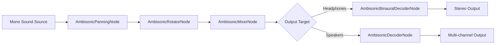

Ambisonics is a full-sphere surround sound technique that represents a 3D sound field mathematically using spherical harmonics. Unlike traditional channel-based audio (stereo, 5.1, 7.1), Ambisonics separates the sound field capture from the reproduction, allowing the same audio content to be decoded for headphones, stereo speakers, or arbitrary multi-speaker arrays.

## Why Ambisonics?

Traditional audio panning places a sound at a specific speaker location. This works well for one listener position but breaks down when:

- The listener moves or turns their head.
- Multiple listeners need different perspectives.
- The speaker layout is unknown or non-standard.

Ambisonics solves these problems by encoding the entire sound field. The decoder then reconstructs the appropriate speaker signals for any given listener orientation and speaker layout.

## Spherical Harmonics

Ambisonics represents the sound field around a point using spherical harmonics — mathematical functions defined on the surface of a sphere. Each "order" of Ambisonics adds more angular resolution:

| Order | Channels | Angular Resolution | Use Case |
|-------|----------|-------------------|----------|
| 0th | 1 | Omnidirectional | Mono ambience |
| 1st | 4 | Broad directional | Basic VR |
| 2nd | 9 | Moderate directional | Desktop VR, games |
| 3rd | 16 | Fine directional | High-end cinematic |

Higher orders capture more directional detail but require more channels and processing power.

## B-Format

The encoded Ambisonic signal is called **B-Format**. Amplitude uses the modern **AmbiX** convention:

- **ACN channel ordering** (SN3D normalization)
- **SN3D** (Schmidt Semi-Normalization) for energy consistency

| Channel | 0th | 1st | 2nd | 3rd |
|---------|-----|-----|-----|-----|
| 0 | W | W | W | W |
| 1 | — | Y | Y | Y |
| 2 | — | Z | Z | Z |
| 3 | — | X | X | X |
| 4 | — | — | V | V |
| 5 | — | — | T | T |
| ... | | | | |

The W channel is omnidirectional. The X, Y, Z channels encode front-back, left-right, and up-down intensity respectively.

## The Amplitude Ambisonic Pipeline

Amplitude uses Ambisonics as an internal mixing format. Here is how audio flows through the Ambisonic pipeline:



### Encoding (AmbisonicPanning)

The `AmbisonicPanningNode` takes a mono sound source and encodes it into B-Format channels based on its 3D position relative to the listener:

```
B-Format channels = mono_sample × spherical_harmonic(direction)
```

Each source contributes to the global sound field independently.

### Rotation (AmbisonicRotator)

When the listener turns their head, the entire sound field must rotate in the opposite direction to keep sounds stable in world space. The `AmbisonicRotatorNode` applies a spherical harmonic rotation matrix:

```
rotated_BFormat = rotation_matrix(yaw, pitch, roll) × BFormat
```

This is far more efficient than rotating each sound source individually, especially with many active voices.

### Mixing (AmbisonicMixer)

The `AmbisonicMixerNode` simply sums all B-Format streams channel-by-channel. Because Ambisonics is linear, summing sound fields is mathematically correct — there is no phase cancellation or comb filtering between mixed sources.

### Decoding

#### Binaural Decoding

For headphone output, the `AmbisonicBinauralDecoderNode` decodes the Ambisonic field to binaural stereo by convolving each spherical harmonic with pre-computed HRIR data:

```
left_ear = sum_over_orders(BFormat_channel × HRTF_left)
right_ear = sum_over_orders(BFormat_channel × HRTF_right)
```

This produces a spatially accurate headphone experience.

#### Speaker Decoding

For speaker arrays, the `AmbisonicDecoderNode` uses a speaker-specific decoding matrix derived from the speaker positions. Amplitude includes presets for the standard layouts exposed by `ePlaybackOutputChannels` (mono, stereo, quad, 5.1, 7.1).

## Energy Compensation

Higher-order Ambisonic channels contain less energy than lower-order ones, and decoding to a finite virtual loudspeaker array can flatten the spectrum further. To keep loudness perception consistent across orders, Amplitude applies energy compensation **inside** `AmbisonicBinauralDecoder` rather than as a separate pipeline node:

- **Max-rE weighting** optimizes the horizontal plane.
- **In-place gain compensation** keeps overall loudness perceptually constant when switching between `BinauralLowQuality`, `BinauralMediumQuality`, and `BinauralHighQuality` panning modes.

## Advantages in Games

Ambisonics is particularly well-suited to game audio because:

1. **Listener rotation is cheap**: Rotate the field once per frame, not once per source.
2. **Multi-listener support**: Decode the same field differently for each listener.
3. **Ambisonic beds**: Pre-recorded Ambisonic ambience (e.g., rain, crowd) mixes naturally with dynamic sources.
4. **Future-proof**: The same content works for stereo, surround, and whatever format comes next.

## Limitations

- **Sweet spot**: Speaker decoding has a limited sweet spot where spatialization is accurate.
- **CPU cost**: Higher orders are expensive to encode, rotate, and decode.
- **Content availability**: Most sound libraries are mono or stereo, not Ambisonic.

## Next Steps

- Follow the [Ambisonic Setup Guide](../integration/ambisonic-setup.md) to configure your project.
- Review the [Pipeline Reference](../project/pipeline.md) for node configuration.
- Learn about [HRTF and Binaural Audio](hrtf-binaural.md).
