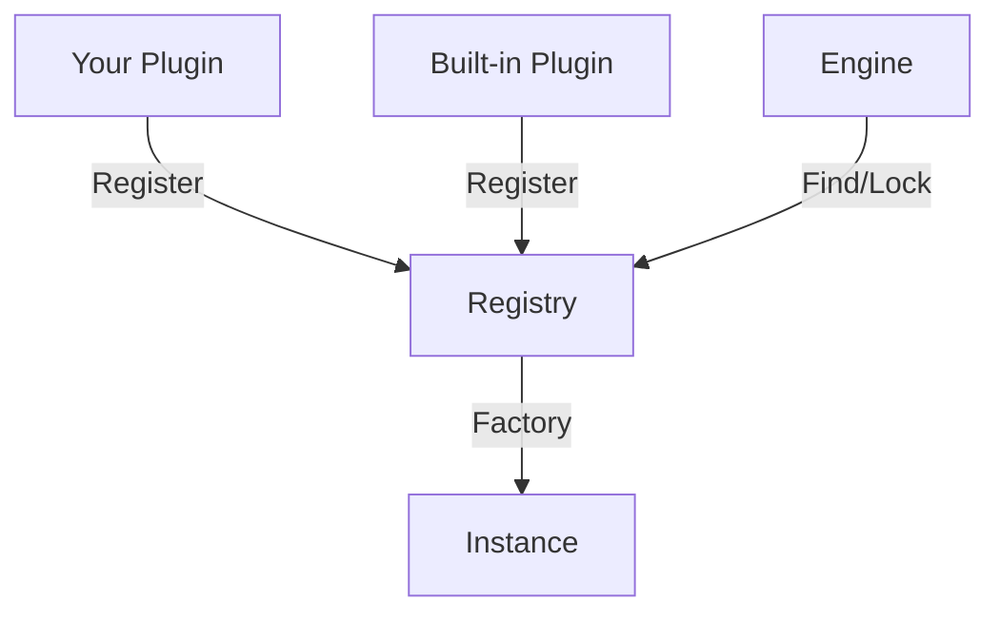

Amplitude is built around a plugin architecture that allows you to extend the engine with custom codecs, drivers, filters, faders, resamplers, and pipeline nodes without modifying the engine source code.

## Registry Pattern

Every plugin type in Amplitude uses the same registry pattern:



Each plugin type has:

1. A **base class** (e.g., `Codec`, `Filter`, `Driver`) that defines the interface.
2. A **static registry** that stores all registered plugins by name.
3. **Factory methods** (`CreateDecoder()`, `CreateInstance()`, etc.) that produce runtime objects.
4. **Lock/Unlock** mechanisms that prevent registration after engine initialization.

## Plugin Types

| Type | Base Class | Factory Method | Use Case |
|------|-----------|----------------|----------|
| **Codec** | `Codec` | `CreateDecoder()`, `CreateEncoder()` | Audio format support |
| **Driver** | `Driver` | `Open()`, `Close()` | Audio hardware abstraction |
| **Filter** | `Filter` | `CreateInstance()` | DSP effects |
| **Fader** | `Fader` | `CreateInstance()` | Transition curves |
| **Resampler** | `Resampler` | `CreateInstance()` | Sample rate conversion |
| **Node** | `Node` | `CreateInstance()` | Pipeline processing |

## Registration

Plugins are registered before `amEngine->Initialize()`:

```cpp
// Register built-in extensions
Engine::RegisterDefaultExtensions();

// Register custom extensions
Codec::Register(std::make_shared<MyCodec>());
Filter::Register(std::make_shared<MyFilter>());
Fader::Register(std::make_shared<MyFader>());

// Lock happens automatically during Engine initialization
amEngine->Initialize(AM_OS_STRING("config.amconfig"));
```

Once the engine is initialized, the registry is locked. Attempting to register a new plugin will silently fail.

## Factory Pattern

The base class acts as a factory for runtime instances:

```cpp
// Look up the plugin by name
auto codec = Codec::Find("wav");

// Create a runtime instance
auto decoder = codec->CreateDecoder();

// Use the instance
decoder->Open(file);
decoder->Load(buffer);
```

This ensures that each sound, channel, or layer gets its own independent state while sharing the plugin's metadata.

## Static vs. Dynamic Plugins

### Static Plugins

Linked directly into the executable at compile time:

```cpp
// Your game code
#include "MyCustomCodec.h"

int main()
{
    Codec::Register(std::make_shared<MyCustomCodec>());
    amEngine->Initialize(AM_OS_STRING("config.amconfig"));
}
```

- **Pros**: No runtime dependencies, works on all platforms.
- **Cons**: Requires recompilation to update.

### Dynamic Plugins

Loaded from shared libraries at runtime:

```cpp
Engine::AddPluginSearchPath(AM_OS_STRING("./plugins"));
Engine::LoadPlugin(AM_OS_STRING("vorbis_plugin"));
amEngine->Initialize(AM_OS_STRING("config.amconfig"));
```

- **Pros**: Can be updated without recompiling the game.
- **Cons**: Desktop platforms only; requires ABI compatibility.

See the [Dynamic Plugins Guide](../integration/dynamic-plugins.md) for details.

## Memory Management

Plugins should use Amplitude's pool-aware allocation macros:

```cpp
// Good: tracked allocation
void* buffer = ampoolmalloc(eMemoryPoolKind_Codec, size);

// Good: pool-aware smart pointer
auto instance = ampoolshared(eMemoryPoolKind_Filtering, MyFilterInstance);
```

This allows the engine to track memory usage per subsystem and detect leaks.

## Version Compatibility

Plugins must be built against the same Amplitude SDK version as the host application. The ABI includes:

- Class layouts (vtables, member offsets)
- Enum values
- Memory allocation conventions

Mixing different SDK versions can cause crashes or silent corruption.

## Thread Safety

Plugin registries are thread-safe for reads (lookups) but not for writes (registration). Register all plugins from the main thread before initializing the engine.

Individual plugin instances may be called from the audio thread. Methods like `Decoder::Stream()` and `FilterInstance::Process()` must be thread-safe and must not block.

## Best Practices

- **One plugin per library**: Keep dynamic plugins focused on a single extension type.
- **Fail gracefully**: If `RegisterPlugin()` cannot register, log an error but do not crash.
- **Document dependencies**: List any third-party libraries your plugin requires.
- **Use unique names**: Prefix custom plugin names to avoid collisions (e.g., `MyGame_Tremolo`).

## Next Steps

- Learn how to write [custom codecs](../tutorials/custom-codec.md), [effects](../tutorials/custom-effect.md), [drivers](../tutorials/custom-driver.md), and [faders](../tutorials/custom-fader.md).
- Explore the [Dynamic Plugins Guide](../integration/dynamic-plugins.md).
