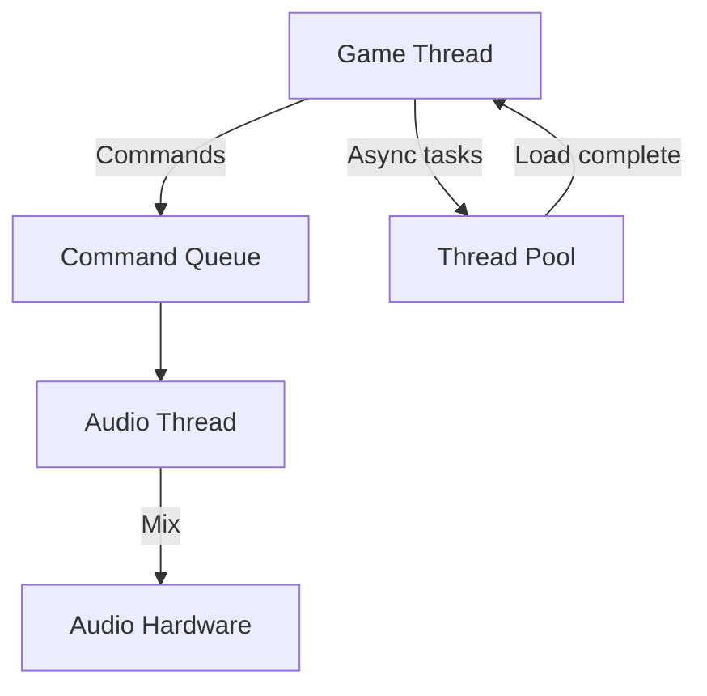

Amplitude's threading model is designed to deliver glitch-free audio while minimizing contention with the game thread. This document explains the threads, queues, and synchronization mechanisms that make this possible.

## Thread Overview

Amplitude uses three categories of threads:

| Thread | Purpose | Priority |
|--------|---------|----------|
| **Game Thread** | Your game's main loop; calls `AdvanceFrame()` | Normal |
| **Audio Thread** | Created by the driver; calls `Mix()` | High / Time-critical |
| **Thread Pool** | Async file I/O, sound loading, batch work | Background |



## Game Thread

The game thread is your application's main thread. It owns all game state and is responsible for:

- Updating entity positions, listener orientation, and RTPC values
- Triggering events and playing sounds
- Calling `Engine::AdvanceFrame()` once per game frame

All Amplitude API calls from the game thread are **non-blocking**. They write commands into lock-free queues rather than modifying shared state directly.

## Audio Thread

The audio thread is created and managed by the audio driver (e.g., MiniAudio). It runs at a high priority and has a very simple responsibility:

1. Wait for the audio device to request a buffer.
2. Call `Amplimix::Mix()` to generate the next buffer of audio.
3. Send the buffer to the hardware.

The audio thread must **never**:

- Perform file I/O
- Allocate memory from the general heap
- Call into game code or third-party libraries

Amplitude enforces these rules by design: the mixer only touches pre-allocated buffers and lock-free queues.

## Command Queues

Communication between the game thread and audio thread happens through lock-free queues:

### MPSC Queue (Multi-Producer, Single-Consumer)

Used for commands from the game thread (and potentially other threads) to the audio thread:

- Play sound
- Stop channel
- Set entity position
- Update RTPC value

### SPSC Queue (Single-Producer, Single-Consumer)

Used for responses from the audio thread back to the game thread:

- Channel playback ended
- Sound file loaded
- Error notifications

Both queues are **lock-free** and **wait-free** for the common case, meaning no mutexes or semaphores are used. This eliminates priority inversion and ensures the audio thread never stalls.

## AdvanceFrame()

`Engine::AdvanceFrame()` is the synchronization point between game and audio:

```cpp
void GameLoop()
{
    UpdateGameState();
    UpdateAudioObjects();

    // Process all queued commands and update internal state
    amEngine->AdvanceFrame();
}
```

During `AdvanceFrame()`, the engine:

1. Drains the MPSC command queue and applies changes to internal state.
2. Updates spatialization, priorities, and virtualization.
3. Prepares mixer layers for the next audio frame.
4. Returns control to the game thread.

`AdvanceFrame()` should be called **once per game frame**, ideally at a fixed interval (e.g., 60 Hz). It does not need to match the audio callback rate (e.g., 480 Hz for a 512-sample buffer at 48 kHz).

## Async Loading

Sound file loading happens on the thread pool to avoid blocking either the game or audio threads:

```cpp
// Start loading sound files from a bank
amEngine->StartLoadSoundFiles(bank);

// Each frame, check if loading is complete
if (amEngine->TryFinalizeLoadSoundFiles(bank))
{
    // All sound data is now in memory and ready for playback
}
```

The thread pool reads file data, decodes it, and places the result in the `SoundData` pool. The audio thread can then reference this data during mixing without blocking.

## File System Threading

File system operations also use the thread pool for async open/close:

```cpp
fs->StartOpenFileSystem();
while (!fs->TryFinalizeOpenFileSystem())
    Thread::Sleep(1);
```

This pattern prevents hitches during engine initialization.

## Best Practices

- **Reduce `malloc` calls from the audio thread**: Pre-allocate all buffers during initialization.
- **Avoid mutexes in custom plugins**: Use atomic operations or lock-free queues instead.

## Next Steps

- Review the [Rendering Loop Guide](../integration/the-rendering-loop.md) for frame timing details.
- Learn about [custom file systems](../integration/custom-file-system.md) for async I/O.
