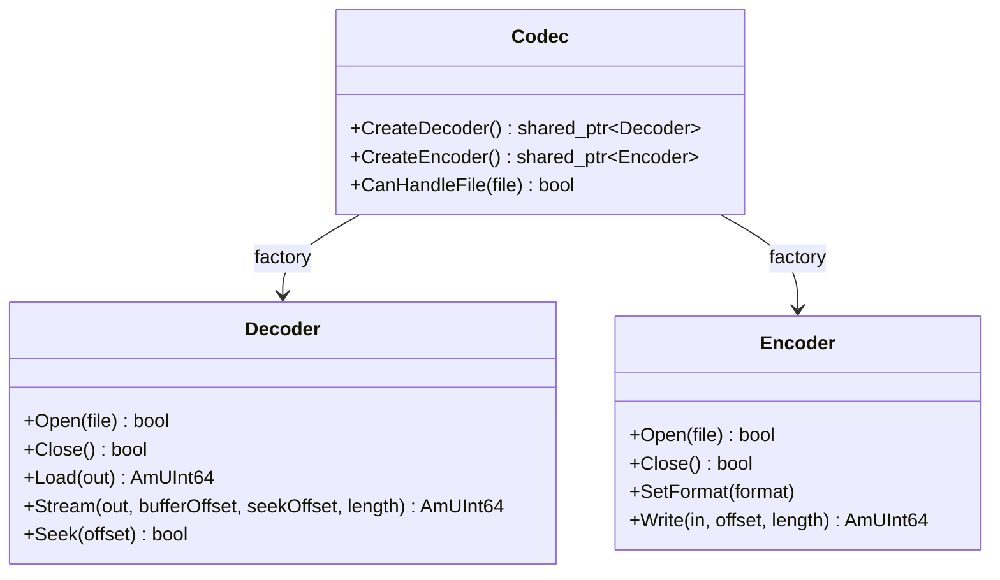

Amplitude's codec architecture provides a flexible, plugin-based system for reading and writing audio files. This document explains the design, key classes, and how data flows through the codec system.

## Design Goals

The codec system is designed around four goals:

1. **Extensibility**: New formats can be added without engine modifications.
2. **Streaming**: Large files can be played without loading everything into memory.
3. **Thread safety**: Decoding must be safe to call from the audio thread.
4. **Uniform output**: All codecs produce the same internal format regardless of source.

## Key Classes



### Codec

The `Codec` base class defines:

- **Name**: Used for lookup (e.g., `"wav"`, `"mp3"`).
- **Factory methods**: `CreateDecoder()` and `CreateEncoder()`.
- **File detection**: `CanHandleFile()` determines if this codec can handle a given file.

### Decoder

The `Decoder` base class handles reading:

- **Open()**: Validates the file and prepares internal state.
- **Load()**: Reads the entire file into an `AudioBuffer`.
- **Stream()**: Reads a specific range of frames into an `AudioBuffer`.
- **Seek()**: Moves the read cursor to a specific frame.

`Stream()` and `Seek()` must be **thread-safe** because they are called from the audio thread during playback.

### Encoder

The `Encoder` base class handles writing:

- **Open()**: Creates or opens the output file.
- **SetFormat()**: Configures the output sample format before writing.
- **Write()**: Writes frames from an `AudioBuffer` to the file.
- **Close()**: Finalizes the file and releases resources.

## Data Flow

### Loading a Sound (Memory Mode)

```
Sound Bank Load
    --> Codec::FindForFile() matches extension / header
    --> Codec::CreateDecoder()
    --> Decoder::Open(file)
    --> Decoder::Load(buffer)
    --> AudioBuffer (de-interleaved float32)
```

### Streaming a Sound

```
Playback Requested
    --> Codec::FindForFile()
    --> Codec::CreateDecoder()
    --> Decoder::Open(file)

Each Audio Frame:
    --> Decoder::Stream(buffer, offset, seek, length)
    --> AudioBuffer (de-interleaved float32)
    --> Mixer
```

## Uniform Output Format

Regardless of the source format, all codecs output:

- **Sample type**: 32-bit float (`eAudioSampleFormat_Float32`)
- **Layout**: De-interleaved channels (planar)
- **Range**: Typically [-1.0, 1.0], though some formats may exceed this

This uniformity means the mixer, effects, and pipeline nodes never need to know the original file format.

## Codec Selection

When loading a sound file, Amplitude selects the codec in this order:

1. Check if any registered codec's `CanHandleFile()` returns `true`.
2. If multiple codecs match, the first registered one wins.
3. If no codec matches, return `eErrorCode_FileLoadFailed`.

!!! tip "Registration order"
    Register built-in codecs first, then custom codecs. This allows custom codecs to override built-in behavior if desired.

## Memory Management

Codec allocations should use the `eMemoryPoolKind_Codec` pool:

```cpp
void* buffer = ampoolmalloc(eMemoryPoolKind_Codec, size);
```

This keeps codec memory isolated and trackable.

## Streaming Buffers

For streaming playback, Amplitude maintains a ring buffer of decoded audio data. The audio thread reads from this buffer while the thread pool (or codec) fills it:

```
Thread Pool          Audio Thread
    |                      |
    v                      v
[Decode chunk] --> [Ring Buffer] --> [Mixer]
```

If the ring buffer underruns (the mixer catches up to the decoder), playback may stutter. To prevent this:

- Use larger stream buffers for slow storage.
- Pre-decode the beginning of the file during `Open()`.

## Error Handling

Codecs should handle errors gracefully:

- **Corrupt files**: Return `false` from `Open()` and log an error.
- **Truncated files**: Return fewer frames than requested from `Stream()`.
- **Unsupported sub-formats**: Reject the file in `CanHandleFile()`.

## Next Steps

- Learn how to write a [custom codec](../tutorials/custom-codec.md).
- Review the [built-in codecs](../reference/codecs.md).
- Explore the [Codec API Reference](../api/engine/Codec.md).
