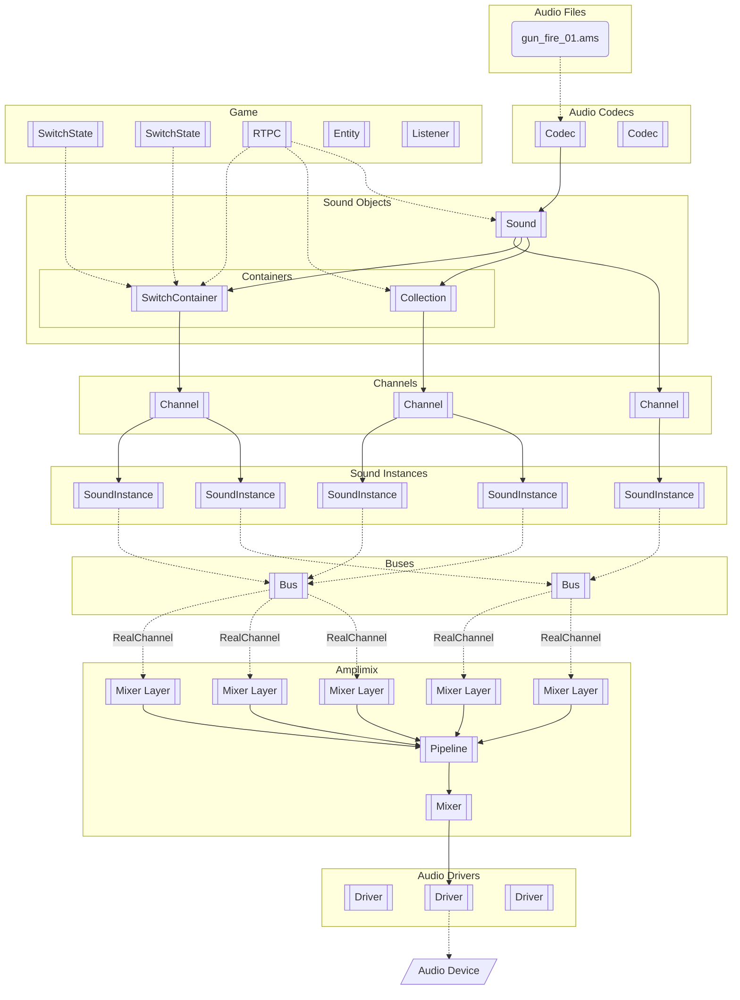

!!! note
    For Amplitude's new users, we highly recommend reading this Concepts documentation page, as it describes the
    internal of the audio engine. If you just want to set up your environment, you can skip this part and go to the
    [Installation](./installation.md).

This page describes the different components of the library and how they are interacting together.

## Audio Files and Codecs

Through its Codec API (extensible via plugins), Amplitude is able to read any audio file and to convert it to a sound
object. An audio file can be read only if the Engine has a registered codec supporting it.

According to the [sound object definition](../project/sound-object.md), audio files can be streamed at runtime or preloaded. Each codec
implementation must always read audio samples as **32-bit floating integer** (`AmReal32`), since it is the default
sample format used in the Engine.

At the moment, Amplitude comes shipped with the following codecs:

- [WAV](https://en.wikipedia.org/wiki/WAV), a lossy audio codec.
- [MP3](https://en.wikipedia.org/wiki/MP3), a lossy audio codec.
- AMS (Amplitude Audio Sample), a WAV-like codec built for Amplitude. It uses a high-quality [ADPCM](https://en.wikipedia.org/wiki/Adaptive_differential_pulse-code_modulation) compression.

Additional codecs are available via plugins:

- [FLAC](https://xiph.org/flac/), a lossless audio codec.
- [OGG](https://www.xiph.org/ogg/), a lossy audio codec.

!!! warning
    The AMS codec implementation is subject to changes.

You can implement your own codec and register it to the Engine by following [this tutorial](../tutorials/custom-codec.md).

## Game Objects

Amplitude synchronizes itself with the game using game objects. The list of available game objects is:

- [SwitchState]: represents a single state in a [SwitchContainer].
- [RTPC]: represents a real-time parameter control that maps values from your game to values in the engine.
- [Entity]: represents a game entity, used to place a [sound object](#sound-objects) in the 2D/3D environment of the game, and then
provide position, velocity, orientation, and other information to the wrapped sound object.
- [Listener]: represents a listener in the game. A listener is an object that is able to hear the sound objects. A game
should have at least one Listener to let Amplitude render spatial audio.

## Sound Objects

A sound object in Amplitude is the source of audio samples. You can apply playback actions to the sound at runtime
(play, pause, stop, seek). Amplitude has two categories of sound objects:

- **Standalone Sound Objects**: A standalone sound object is a sound object that is not part of a Container. They can be
directly linked to a [SoundInstance] and a Codec.
- **Containers**: A Container is a special sound object able to contain other sound objects. It can overwrite some
properties of contained sound objects (like gain, or priority) and is responsible to manage which of the contained sound
objects are playing, and when.

From those categories, we have the following list of sound objects:

- [Sound]: The most basic sound object. A Sound is a **standalone sound object**, then, it is directly linked to a
Codec, and it is responsible to load and stream sound data.
- [Collection]: A Collection is a **container sound object**, and is, like its name says, a collection of Sounds. The
Collection has the particularity to pick and play a single Sound through its _scheduler_ each time it receives a play
request. A Collection cannot play more than one Sound at the same time.
- [SwitchContainer]: A SwitchContainer is a **container sound object** which contains Sounds or Collections. It mixes
and plays contained sound objects according to [SwitchState]s. Sound objects registered inside a switch container for a
specific switch state are played only when this switch state is active. Unlike collections, switch containers can play
more than one sound object at the same time.

Each sound object is created through a JSON configuration file which should match a specific [flatbuffer schema](../project/sound-object.md)
for the sound object.

## Channels

A channel is the user interface between sound objects and [Amplimix](#amplimix). When playing a sound object, the Engine
will return a channel. That channel will then internally instantiate a [SoundInstance], and be linked to a [Bus]. It's
through a channel that you can play, pause and stop a sound object, and also control its properties, like the gain, or
the location (for world-scoped sound objects).

In Amplitude, the maximum number of channels is limited and determined at the Engine initialization. That number is the
sum of the number of **active channels** and the number of **virtual channels**, which are both defined in the engine
configuration file.

Amplitude will manage the prioritization of sound objects and will automatically drop the least important channels when
too many sound objects are playing simultaneously. This is the reason behind the concept of active and virtual channels.
The active channels are the channels that are actually playing and rendering audio, while the virtual channels are also
playing audio but are not rendering it and are only used to track low-priority sounds which are still playing.

When requesting to play a sound object:

1. The Engine will pick a channel in the list of free active channels.
2. If there is no free channel, the Engine will pick a channel in the list of free virtual channels.
3. If there is still no free channel, the Engine will drop the least important sound object.
4. If the sound object to play is actually the one with the lowest priority, it will not be played.

## Sound Instances

The [SoundInstance] is the real place where the Engine is consuming audio data for mixing. When playing a same sound
object multiple times, multiple sound instances will be created for each play request, but all of them will share the
same audio data since it belong to that sound object. Sound instances only share audio data, and not properties like
gain, pan, pitch, location, or priority which are instead managed through the Channel in which they are playing.

It's only in cases of streamed audio that each sound instance owns the audio data.

## Buses

The [Bus] is used to adjust the gain of a group of sound instances in tandem. They are created before the Engine
initialization with the [buses configuration file](../project/buses-config.md). Any number of buses can be created.

It's inside the sound object definition file that you specify on which bus it has to be played on. Example buses might
be `music`, `ambient_sound`, `sound_effects` or `voice_overs`.

A bus has the particularity to optionally have other buses as child buses, which means that all changes to that bus' gain
level affect all children of that bus as well. There should always be a single “master” bus, with name `master`, and with
ID `1`. This is the root bus from which all other buses descend. The engine will fail to initialize if the `master` bus
is not found.

A bus may also define `duck_buses`, which are buses that will lower in volume when a sound is played on that first bus.
For example, a designer might want to have background sound effects and music lower in volume when an important dialog
is playing. To achieve this, the `sound_effect` and `music` buses would be added in the list of `duck_buses` children
of the `dialog` bus.

## Real Channels

Real Channels are internally managed channels that communicate directly with Amplimix. They are created for each
**active channel** and used only when the channel is rendering audio.

## Amplimix

Amplimix is the part of Amplitude doing sound mixing. It is composed of two (02) parts linked together to render audio:
the mixer layers, and the pipeline.

### Mixer Layers

A Mixer Layer is responsible for consuming audio data from sound instances and providing it to the Amplimix Pipeline.
A mixer layer stores, for a unique sound instance, the related state for its playback, like the current position of the
cursor, the current gain, the current pan, the current pitch, and the current sample rate converter.

Amplimix has a hard-coded maximum of **4096** mixer layers, which is the maximum number of sound instances that can be
played simultaneously.

### Pipeline

The Pipeline is used to process the sound before the mixer gets the final output to render on the device. It's in the
pipeline that Amplitude processes sound spatialization, effects, obstruction, occlusion, and more.

The pipeline is a node-graph built with connected [Node] instances. Amplitude comes shipped with a list of predefined
nodes to achieve high-quality spatialization, but you are completely able to build your own pipeline nodes through
plugins and register them into the engine.

Pipelines are created using [pipeline assets](../project/pipeline.md), and registered through the [engine configuration file](../project/engine-config.md).

## Audio Drivers

The [Driver] is used to render the audio data on the device. It should assume the entire responsibility to convert the
input data (the processed data from Amplimix) to the output format required by the device. That output format includes
the number of channels, the sample rate, the sample format, and the number of samples per output.

The default driver provided by Amplitude is built on top of the [MiniAudio](https://miniaud.io) library and allows Amplitude to run on
all available platforms.

## Audio Device

The audio Device renders audio. Amplitude has a copy of the current audio device description in the [DeviceDescription]
stored in Amplimix. The device description gives the user-requested audio format (copied from configuration files) and
the actual audio format that the device is expecting. It's to the [Driver] implementation to fill the device description
in Amplimix with the obtained values from the audio device.

Amplimix will process the audio using the user-requested format and let to the driver the responsibility to convert the
data to the device audio format.

[SwitchState]: /api/structSparkyStudios_1_1Audio_1_1Amplitude_1_1SwitchState
[RTPC]: /api/classSparkyStudios_1_1Audio_1_1Amplitude_1_1Rtpc
[Entity]: /api/classSparkyStudios_1_1Audio_1_1Amplitude_1_1Entity
[Listener]: /api/classSparkyStudios_1_1Audio_1_1Amplitude_1_1Listener
[SoundInstance]: /api/classSparkyStudios_1_1Audio_1_1Amplitude_1_1SoundInstance
[Sound]: /api/classSparkyStudios_1_1Audio_1_1Amplitude_1_1Sound
[Collection]: /api/classSparkyStudios_1_1Audio_1_1Amplitude_1_1Collection
[Bus]: /api/classSparkyStudios_1_1Audio_1_1Amplitude_1_1Bus
[SwitchContainer]: /api/classSparkyStudios_1_1Audio_1_1Amplitude_1_1SwitchContainer
[DeviceDescription]: /api/classSparkyStudios_1_1Audio_1_1Amplitude_1_1DeviceDescription
[Driver]: /api/classSparkyStudios_1_1Audio_1_1Amplitude_1_1Driver
[Node]: /api/classSparkyStudios_1_1Audio_1_1Amplitude_1_1Node
