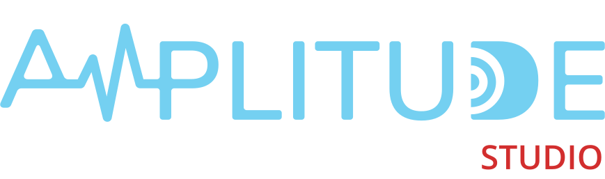

Amplitude Studio is the official authoring tool for your Amplitude projects. The tool offers a graphical user interface and some command line utilities to create, manage, and ship your projects with ease.

<figure style="text-align: center; margin: 2rem 0;" markdown="span">
{ height="96px" }
</figure>

Amplitude Studio is currently in EAP (Early Access Program) phase! Head to the [Amplitude Studio](https://studio.amplitudeaudiosdk.com) to learn more.
