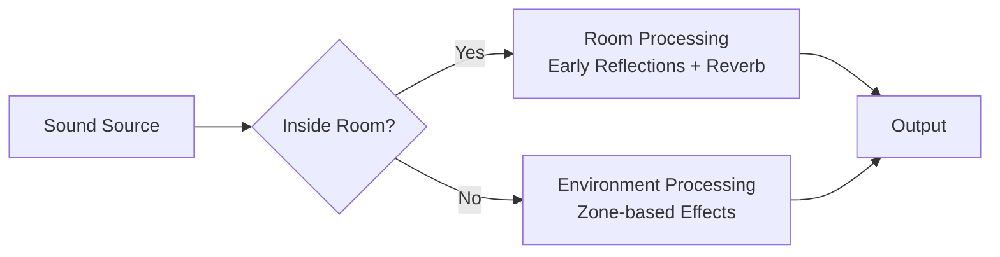

This guide explains how to use Amplitude's **Room** and **Environment** systems to create realistic acoustic spaces. Rooms simulate early reflections and reverberation based on physical dimensions and wall materials, while Environments apply DSP effects to sounds within defined zones.

## Overview

Amplitude provides two complementary systems for spatial acoustics:

| System | Purpose | Best For |
|--------|---------|----------|
| **Environment** | Zone-based effect application (reverb, delay, EQ) | Outdoor areas, caves, underwater zones |
| **Room** | Physically modeled early reflections and reverb | Indoor spaces with defined geometry |



## Environments

An `Environment` is a zone in 3D space where every spatialized sound receives an additional effect. Environments are ideal for areas with irregular shapes or outdoor spaces.

### Creating an Environment

```cpp
// Add an environment with a unique ID
amEngine->AddEnvironment(100);

// Get the environment handle
Environment env = amEngine->GetEnvironment(100);

// Set its position and orientation
env.SetLocation(AmVector3(10.0f, 0.0f, 10.0f));
env.SetOrientation(Orientation::FromLookAt(AmVector3(0, 0, 1), AmVector3(0, 1, 0)));

// Define the zone shape (e.g., a sphere with 5m radius)
auto zone = std::make_shared<SphereShape>(5.0f);
env.SetZone(zone);

// Assign a reverb effect
env.SetEffect("cave_reverb");
```

### Environment Factor

The engine computes an **environment factor** for each entity based on its position relative to the environment zone. This factor (0.0 to 1.0) controls how much of the environment effect is applied:

```cpp
// Query how much an entity is inside the environment
AmReal32 factor = env.GetFactor(entity);
// factor = 1.0: fully inside
// factor = 0.0: fully outside
// factor = 0.5: at the zone boundary
```

The factor transitions smoothly at the zone boundary, creating natural crossfades between environments.

### Zone Shapes

Environments support the same shape types as attenuation models:

| Shape | Description |
|-------|-------------|
| `Box` | Axis-aligned box defined by dimensions |
| `Sphere` | Spherical zone defined by radius |
| `Capsule` | Capsule zone defined by radius and height |
| `Cone` | Conical zone defined by radius and angle |

## Rooms

A `Room` is a physically modeled acoustic space with six walls, each with its own material properties. Rooms calculate early reflections and reverberation based on the room's dimensions and surface absorption.

### Creating a Room

```cpp
// Add a room with a unique ID
amEngine->AddRoom(200);

// Get the room handle
Room room = amEngine->GetRoom(200);

// Set position and orientation
room.SetLocation(AmVector3(50.0f, 2.5f, 30.0f));
room.SetOrientation(Orientation::Identity());

// Set dimensions (width, height, depth in meters)
room.SetDimensions(AmVector3(10.0f, 3.0f, 8.0f));

// Set wall materials
room.SetAllWallMaterials(RoomWallMaterial(eRoomWallMaterialType_ConcreteUnpainted));

// Or set materials per wall
room.SetWallMaterials(
    RoomWallMaterial(eRoomWallMaterialType_GypsumBoard),   // Left
    RoomWallMaterial(eRoomWallMaterialType_GypsumBoard),   // Right
    RoomWallMaterial(eRoomWallMaterialType_CarpetOnConcrete), // Floor
    RoomWallMaterial(eRoomWallMaterialType_AcousticTile),  // Ceiling
    RoomWallMaterial(eRoomWallMaterialType_Glass),         // Front
    RoomWallMaterial(eRoomWallMaterialType_BrickPainted)   // Back
);

// Adjust the room effect gain
room.SetGain(0.8f);
```

### Wall Materials

Amplitude includes predefined materials with realistic absorption coefficients:

| Material | Description | Absorption |
|----------|-------------|------------|
| `Transparent` | No absorption (open boundary) | None |
| `AcousticTile` | Ceiling acoustic tiles | High |
| `CarpetOnConcrete` | Carpet over concrete | Medium-High |
| `HeavyDrapes` | Thick curtains | Medium-High |
| `GypsumBoard` | Standard drywall | Medium |
| `ConcreteUnpainted` | Bare concrete | Low |
| `Wood` | Wooden panels | Medium |
| `BrickPainted` | Painted brick | Low-Medium |
| `FoamPanel` | Acoustic foam | Very High |
| `Glass` | Glass windows | Very Low |
| `PlasterSmooth` | Smooth plaster | Low |
| `Metal` | Metal sheets | Very Low |
| `Marble` | Marble/stone | Very Low |
| `WaterSurface` | Water | Low |
| `IceSurface` | Ice | Very Low |
| `Custom` | User-defined coefficients | Configurable |

### Custom Materials

For precise control, define custom absorption coefficients:

```cpp
RoomWallMaterial custom;
custom.m_type = eRoomWallMaterialType_Custom;

// Set absorption coefficients for 9 frequency bands
// Values range from 0.0 (fully reflective) to 1.0 (fully absorptive)
custom.m_absorptionCoefficients[0] = 0.1f; // Low frequencies
custom.m_absorptionCoefficients[1] = 0.2f;
custom.m_absorptionCoefficients[2] = 0.3f;
custom.m_absorptionCoefficients[3] = 0.4f;
custom.m_absorptionCoefficients[4] = 0.5f; // Mid frequencies
custom.m_absorptionCoefficients[5] = 0.6f;
custom.m_absorptionCoefficients[6] = 0.7f;
custom.m_absorptionCoefficients[7] = 0.8f;
custom.m_absorptionCoefficients[8] = 0.9f; // High frequencies

room.SetWallMaterial(eRoomWall_Left, custom);
```

### Room Geometry

The room's shape is always a box. You can query its acoustic properties:

```cpp
AmReal32 volume = room.GetVolume();           // in cubic meters
AmVector3 dims = room.GetDimensions();         // width, height, depth
AmReal32 floorArea = room.GetSurfaceArea(eRoomWall_Floor);
AmReal32 ceilingArea = room.GetSurfaceArea(eRoomWall_Ceiling);
```

These values are used internally to calculate reverb time (RT60) and early reflection patterns.

## Engine Configuration

Enable room and environment tracking in the engine configuration:

```json
{
  "game": {
    "track_environments": true,
    "environments": 512,
    "rooms": 1024
  }
}
```

| Option | Description |
|--------|-------------|
| `track_environments` | Enables environment factor computation per entity. |
| `environments` | Maximum number of simultaneous environments. |
| `rooms` | Maximum number of simultaneous rooms. |

## Runtime Behavior

### Assignment

Entities and listeners are automatically associated with rooms and environments based on their positions. You do not need to manually assign them — the engine tracks which zones each object occupies.

### Priority

When an entity is inside multiple overlapping environments, the one with the highest factor dominates. For rooms, the engine blends contributions from all containing rooms based on the entity's position.

### Pipeline Integration

The default pipeline includes nodes for room and environment processing:

| Node | Function |
|------|----------|
| `EnvironmentEffect` | Applies the environment's assigned effect to sounds inside the zone. |
| `Reflections` | Computes early reflections based on room geometry. |
| `Reverb` | Applies late reverberation based on room materials and dimensions. |

## Best Practices

- **Use Rooms for indoor spaces** with well-defined geometry (buildings, vehicles, corridors).
- **Use Environments for outdoor or irregular zones** (forests, underwater, caves).
- **Keep room counts reasonable**: Each room adds CPU cost for reflection calculations.
- **Use predefined materials** when possible; they are based on real acoustic measurements.
- **Test with headphones** for the most accurate spatial impression.

## Example: Multi-Room Building

```cpp
// Lobby
amEngine->AddRoom(1);
Room lobby = amEngine->GetRoom(1);
lobby.SetDimensions(AmVector3(20.0f, 4.0f, 15.0f));
lobby.SetAllWallMaterials(RoomWallMaterial(eRoomWallMaterialType_Marble));
lobby.SetGain(0.6f);

// Office
amEngine->AddRoom(2);
Room office = amEngine->GetRoom(2);
office.SetDimensions(AmVector3(5.0f, 2.8f, 4.0f));
office.SetAllWallMaterials(RoomWallMaterial(eRoomWallMaterialType_GypsumBoard));
office.SetWallMaterial(eRoomWall_Floor, RoomWallMaterial(eRoomWallMaterialType_CarpetOnConcrete));
office.SetGain(0.4f);

// Cave environment (outdoor connection)
amEngine->AddEnvironment(100);
Environment cave = amEngine->GetEnvironment(100);
cave.SetLocation(AmVector3(100.0f, -5.0f, 50.0f));
cave.SetZone(std::make_shared<SphereShape>(30.0f));
cave.SetEffect("cave_reverb");
```

## Next Steps

- Review the [Managing Game Objects](managing-game-objects.md) guide for entity and listener setup.
- Explore the [Effect Reference](../project/effect.md) for available DSP effects.
- Learn about the [Pipeline Reference](../project/pipeline.md) to customize room and environment processing.
