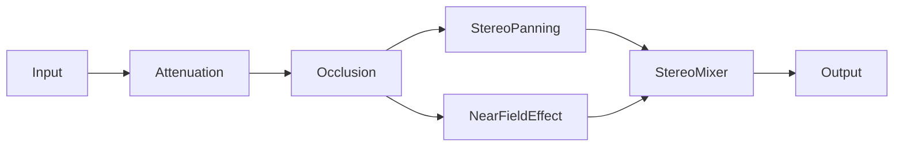

Pipelines define how audio data flows through the Amplimix processing system before reaching the audio device. Using a node-graph architecture, pipelines allow you to chain together various processing nodes to create custom audio rendering paths.

## Pipeline Architecture

A pipeline is a directed acyclic graph (DAG) of processing nodes. Audio data enters through an **Input** node, flows through various processing nodes, and exits through an **Output** node.



Each sound source in your game gets its own pipeline instance, allowing per-sound processing with unique spatial properties.

!!! note
    The pipeline used by the engine is configured in the [engine configuration](./engine-config.md). Currently, the same pipeline is applied to all sounds.

## Pipeline Definition

Pipelines are defined as JSON files in your project's `pipelines/` directory and compiled to `.ampipeline` binary assets when building your project. Each pipeline contains:

- **id** — Unique identifier for the pipeline
- **name** — Human-readable name
- **nodes** — Array of node definitions

### Node Definition

Each node in the pipeline has:

- **id** — Unique node ID within this pipeline
- **name** — The registered node type name
- **consume** — Array of node IDs this node receives input from
- **parameters** — Optional array of float parameters for node configuration

## Available Nodes

Amplitude provides a comprehensive set of built-in pipeline nodes:

### Input/Output Nodes

| Node | Description |
|------|-------------|
| `Input` | Entry point for audio data. Every pipeline must have exactly one. |
| `Output` | Exit point for processed audio. Every pipeline must have exactly one. |

### Mixer Nodes

Mixer nodes combine multiple audio streams into one.

| Node | Description |
|------|-------------|
| `StereoMixer` | Mixes multiple inputs to stereo output |
| `AmbisonicMixer` | Mixes multiple inputs to Ambisonic format |

### Spatial Processing Nodes

These nodes handle 3D audio positioning and spatialization.

| Node | Description |
|------|-------------|
| `Attenuation` | Applies distance-based volume attenuation |
| `StereoPanning` | Pans audio in stereo based on source position (uses HRTF when enabled) |
| `AmbisonicPanning` | Encodes audio into Ambisonic format based on source direction |
| `AmbisonicRotator` | Rotates Ambisonic audio to match listener orientation |
| `AmbisonicBinauralDecoder` | Decodes Ambisonic audio to binaural stereo for headphone playback |
| `NearFieldEffect` | Applies near-field HRTF processing for close sound sources |

### Environmental Processing Nodes

These nodes simulate acoustic environments.

| Node | Description |
|------|-------------|
| `Reverb` | Applies room-based reverberation based on configured Room properties |
| `Reflections` | Simulates early reflections from room surfaces |
| `EnvironmentEffect` | Applies Environment zone effects based on entity position |

### Obstruction/Occlusion Nodes

These nodes simulate sound passing through obstacles.

| Node | Description |
|------|-------------|
| `Obstruction` | Applies obstruction filtering (partial blocking of direct path) |
| `Occlusion` | Applies occlusion filtering (complete blocking requiring sound to travel around) |

### Dynamics/Limiting Nodes

These nodes control signal levels.

| Node | Description |
|------|-------------|
| `Limiter` | Soft-knee limiter to prevent clipping |
| `Clamp` | Hard value clamping |
| `HardClip` | Hard clipping at threshold |
| `RoundoffClip` | Rounded clipping for smoother distortion |

## Node Types

Pipeline nodes fall into three categories based on how they handle audio:

### Producer Nodes

Producer nodes generate or receive audio data and don't consume input from other nodes.

- `Input` — The only built-in producer node

### Consumer Nodes

Consumer nodes receive input from exactly one other node and produce output.

- All processing nodes (`Attenuation`, `StereoPanning`, `Reverb`, etc.)
- `Output` — The terminal consumer node

### Mixer Nodes

Mixer nodes can receive input from multiple nodes and combine them.

- `StereoMixer`
- `AmbisonicMixer`

## Pipeline Rules

When designing pipelines, follow these rules:

1. **One Input, One Output** — Every pipeline must have exactly one `Input` node and one `Output` node
2. **Connected Graph** — All nodes must be connected; no orphaned nodes
3. **No Cycles** — The graph must be acyclic (no circular dependencies)
4. **No Self-Consumption** — A node cannot consume its own output
5. **Single Consumer Input** — Consumer nodes (non-mixers) can only consume from one source
6. **Valid Node Names** — All node names must be registered in the engine

## Example Pipelines

### Simple Stereo Pipeline

A basic stereo pipeline suitable for games that don't need Ambisonic processing:

```json
{
  "id": 3,
  "name": "stereo",
  "nodes": [
    { "id": 1, "name": "Input", "consume": [] },
    { "id": 2, "name": "Attenuation", "consume": [1] },
    { "id": 3, "name": "Occlusion", "consume": [2] },
    { "id": 4, "name": "StereoPanning", "consume": [3] },
    { "id": 6, "name": "NearFieldEffect", "consume": [3] },
    { "id": 8, "name": "StereoMixer", "consume": [4, 6] },
    { "id": 9, "name": "Output", "consume": [8] }
  ]
}
```

This pipeline:

1. Takes audio input
2. Applies distance-based attenuation
3. Applies occlusion filtering
4. Branches into stereo panning and near-field effect processing
5. Mixes both branches together
6. Outputs the final stereo signal

### Full-Featured Pipeline

A comprehensive pipeline with all spatial and environmental processing:

```json
{
  "id": 1,
  "name": "default",
  "nodes": [
    { "id": 1, "name": "Input", "consume": [] },
    { "id": 2, "name": "Attenuation", "consume": [1] },
    { "id": 3, "name": "Occlusion", "consume": [2] },
    { "id": 4, "name": "StereoPanning", "consume": [17] },
    { "id": 5, "name": "AmbisonicPanning", "consume": [3] },
    { "id": 6, "name": "NearFieldEffect", "consume": [3] },
    { "id": 7, "name": "AmbisonicMixer", "consume": [18] },
    { "id": 8, "name": "StereoMixer", "consume": [4, 6, 10, 12, 14] },
    { "id": 10, "name": "AmbisonicBinauralDecoder", "consume": [7] },
    { "id": 11, "name": "Reflections", "consume": [1] },
    { "id": 12, "name": "AmbisonicBinauralDecoder", "consume": [11] },
    { "id": 13, "name": "HardClip", "consume": [8] },
    { "id": 14, "name": "Reverb", "consume": [1] },
    { "id": 15, "name": "Obstruction", "consume": [3] },
    { "id": 16, "name": "EnvironmentEffect", "consume": [3] },
    { "id": 17, "name": "StereoMixer", "consume": [15, 16] },
    { "id": 18, "name": "AmbisonicRotator", "consume": [5] },
    { "id": 9, "name": "Output", "consume": [13] }
  ]
}
```

This pipeline includes:

- Distance attenuation and occlusion
- Both stereo and Ambisonic spatial paths
- Obstruction and environment effects
- Room reverb and early reflections
- Near-field HRTF processing
- Binaural decoding for headphone output
- Final hard clipping for safety

### Minimal Music Pipeline

A simple pipeline for background music that doesn't need spatial processing:

```json
{
  "id": 100,
  "name": "music",
  "nodes": [
    { "id": 1, "name": "Input", "consume": [] },
    { "id": 2, "name": "Limiter", "consume": [1] },
    { "id": 3, "name": "Output", "consume": [2] }
  ]
}
```

This applies only limiting to prevent clipping—ideal for pre-mixed audio content.

## Performance Considerations

Pipeline complexity directly affects CPU usage:

- **More nodes = more processing** — Each node adds computational overhead
- **Ambisonic processing** — Higher order Ambisonics require more CPU
- **Room simulation** — Reverb and reflections are computationally expensive
- **Per-sound instances** — Each playing sound has its own pipeline instance

For mobile or CPU-constrained platforms, consider:

- Using simpler pipelines with fewer nodes
- Disabling binaural processing when not using headphones
- Limiting the number of simultaneous sounds

!!! tip "API Reference available"
    Check out the [API reference](../api/mixer/Pipeline.md) for the complete list of methods you can use with Pipelines.
