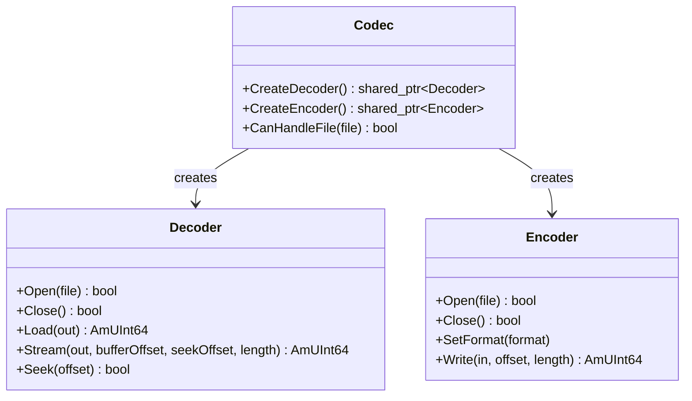

This tutorial walks you through creating a custom audio codec for the Amplitude engine. You will build a **Raw PCM codec** — a simple reader for uncompressed raw audio data — and learn how to register it as a plugin so the engine can load your files at runtime.

## Architecture Overview

In Amplitude, codecs are built on top of the **Codec** system. To create a custom codec, you need three classes:

1. **Codec** — Defines the codec metadata (name) and acts as a factory for creating decoders and encoders.
2. **Decoder** — Reads audio data from a file into an `AudioBuffer`. Supports both full loading and streaming.
3. **Encoder** — Writes audio data from an `AudioBuffer` into a file.



At runtime, the engine uses `CanHandleFile()` to automatically pick the right codec for each audio file. When a sound is played, the engine creates a `Decoder` instance to read the data.

## Step 1: Define the Decoder

Create a header file for your custom codec. The `Decoder` subclass handles reading audio data from the file system:

```cpp
// RawPCMCodec.h

#pragma once

#include <SparkyStudios/Audio/Amplitude/Amplitude.h>

using namespace SparkyStudios::Audio::Amplitude;

class RawPCMCodec final : public Codec
{
public:
    class RawPCMDecoder final : public Decoder
    {
    public:
        explicit RawPCMDecoder(const Codec* codec)
            : Decoder(codec)
            , _initialized(false)
        {}

        bool Open(std::shared_ptr<File> file) override
        {
            if (!m_codec->CanHandleFile(file))
                return false;

            _file = file;

            // Raw PCM format: 48kHz, stereo, 16-bit signed integer
            m_format.SetAll(
                48000,   // sampleRate
                2,       // channels
                16,      // bitsPerSample
                _file->Length() / 4, // total frames (4 bytes per frame: 2 channels × 2 bytes)
                4,       // frame size
                eAudioSampleFormat_Int16
            );

            _initialized = true;
            return true;
        }

        bool Close() override
        {
            if (!_initialized)
                return true;

            _file.reset();
            m_format = SoundFormat();
            _initialized = false;
            return true;
        }

        AmUInt64 Load(AudioBuffer* out) override
        {
            return Stream(out, 0, 0, m_format.GetFramesCount());
        }

        AmUInt64 Stream(AudioBuffer* out, AmUInt64 bufferOffset, AmUInt64 seekOffset, AmUInt64 length) override
        {
            if (!_initialized)
                return 0;

            Seek(seekOffset);

            const AmUInt64 framesToRead = AM_MIN(length, m_format.GetFramesCount() - seekOffset);
            const AmUInt64 bytesToRead = framesToRead * m_format.GetFrameSize();

            std::vector<AmInt16> pcmData(framesToRead * m_format.GetNumChannels());
            _file->Read(reinterpret_cast<AmUInt8Buffer>(pcmData.data()), bytesToRead);

            // Convert interleaved int16 to de-interleaved float32 in the AudioBuffer
            for (AmUInt16 ch = 0; ch < m_format.GetNumChannels(); ++ch)
            {
                for (AmUInt64 i = 0; i < framesToRead; ++i)
                {
                    const AmInt16 sample = pcmData[i * m_format.GetNumChannels() + ch];
                    out->GetData()[ch][bufferOffset + i] = AmInt16ToReal32(sample);
                }
            }

            return framesToRead;
        }

        bool Seek(AmUInt64 offset) override
        {
            if (!_initialized)
                return false;

            const AmUInt64 byteOffset = offset * m_format.GetFrameSize();
            _file->Seek(static_cast<AmInt64>(byteOffset), eFileSeekOrigin_Start);
            return true;
        }

    private:
        std::shared_ptr<File> _file;
        bool _initialized;
    };

    class RawPCMEncoder final : public Encoder
    {
    public:
        explicit RawPCMEncoder(const Codec* codec)
            : Encoder(codec)
            , _initialized(false)
        {}

        bool Open(std::shared_ptr<File> file) override
        {
            _file = file;
            _initialized = true;
            return true;
        }

        bool Close() override
        {
            if (!_initialized)
                return true;

            _file.reset();
            _initialized = false;
            return true;
        }

        AmUInt64 Write(AudioBuffer* in, AmUInt64 offset, AmUInt64 length) override
        {
            if (!_initialized)
                return 0;

            const AmUInt16 channels = in->GetChannelCount();
            std::vector<AmInt16> pcmData(length * channels);

            for (AmUInt16 ch = 0; ch < channels; ++ch)
            {
                for (AmUInt64 i = 0; i < length; ++i)
                {
                    pcmData[i * channels + ch] = AmReal32ToInt16(in->GetData()[ch][offset + i]);
                }
            }

            _file->Write(
                reinterpret_cast<AmConstUInt8Buffer>(pcmData.data()),
                length * channels * sizeof(AmInt16));

            return length;
        }

    private:
        std::shared_ptr<File> _file;
        bool _initialized;
    };

    RawPCMCodec()
        : Codec("raw")
    {}

    ~RawPCMCodec() override = default;

    std::shared_ptr<Decoder> CreateDecoder() override
    {
        return ampoolshared(eMemoryPoolKind_Codec, RawPCMDecoder, this);
    }

    std::shared_ptr<Encoder> CreateEncoder() override
    {
        return ampoolshared(eMemoryPoolKind_Codec, RawPCMEncoder, this);
    }

    bool CanHandleFile(std::shared_ptr<File> file) const override
    {
        if (!file)
            return false;

        // Accept any file with the .raw extension
        const AmString path = file->GetPath();
        return path.size() > 4 && path.compare(path.size() - 4, 4, ".raw") == 0;
    }
};
```

## Step 2: Register the Codec

Before initializing the engine, register your codec:

```cpp
#include "RawPCMCodec.h"

int main(int argc, char* argv[])
{
    // ... initialize memory manager, file system, etc.

    // Register the custom codec
    Codec::Register(std::make_shared<RawPCMCodec>());

    // Now initialize the engine
    Engine::Init(config);

    // The engine will automatically use the RawPCMCodec for any .raw files
}
```

!!! tip "Registration order"
    Codecs must be registered **before** `Engine::Init()` is called. Once the engine is initialized, the codec registry is locked.

## Step 3: Create a Sound Asset

Create a sound asset JSON file that references your raw audio file:

```json
{
  "id": 42,
  "name": "ambient_wind",
  "path": "sounds/ambient_wind.raw",
  "stream": false,
  "loop": {
    "enabled": true,
    "loop_count": 0
  }
}
```

Compile the project with `build_project.py` and load the bank at runtime. The engine will automatically route `.raw` files to your custom codec.

## Step 4: Streaming vs Loading

The `Decoder` interface supports two modes of operation:

- **Load mode**: The entire file is read into memory in one call to `Load()`. This is ideal for short sound effects.
- **Stream mode**: Small chunks are read on demand via `Stream()`. This is required for long music or ambient tracks to keep memory usage low.

When `stream: true` is set in the sound asset, the engine will call `Stream()` repeatedly during playback. Your implementation must be thread-safe, as `Stream()` may be called from the audio thread.

## Memory Management

Always use Amplitude's pool-aware allocation macros when allocating memory inside your codec:

```cpp
// Good: uses the Codec memory pool
void* buffer = ampoolmalloc(eMemoryPoolKind_Codec, size);

// Bad: bypasses the engine's memory tracking
void* buffer = malloc(size);
```

The `eMemoryPoolKind_Codec` pool is reserved for codec allocations. Using it allows the engine to track memory usage and report statistics.

## Thread Safety

Both `Decoder::Stream()` and `Encoder::Write()` may be called from the audio processing thread. Ensure your implementation does not perform blocking I/O inside these methods. If you need to perform heavy work, do it in `Open()` or `Load()`, which are called from the main thread.

## Next Steps

- Learn how to write [custom effects](custom-effect.md) to process audio at runtime.
- Explore the [Codec API Reference](../api/engine/Codec.md) for the full interface.
- Look at the built-in WAV and MP3 codecs in the SDK source for production-ready examples.
