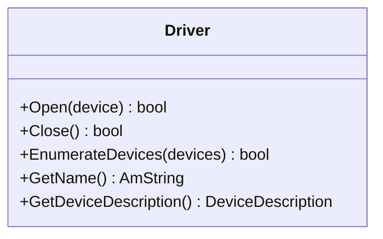

This tutorial walks you through creating a custom audio driver for the Amplitude engine. You will build a **Timer Driver** — a simple cross-platform driver that feeds audio to the mixer on a fixed interval — and learn how to register it so the engine can use it for playback.

## Architecture Overview

In Amplitude, a **Driver** is the bridge between the engine's mixer and the physical audio hardware. To create a custom driver, you need one class that inherits from `Driver`:



The driver is responsible for:

1. **Opening** the audio device with the requested format (sample rate, channels, buffer size).
2. **Feeding** the mixer with a callback or thread that periodically calls `Amplimix::Mix()`.
3. **Closing** the device cleanly when the engine shuts down.
4. **Enumerating** available devices so users can select which one to use.

## Step 1: Define the Driver Class

Create a header file for your custom driver:

```cpp
// TimerDriver.h

#pragma once

#include <SparkyStudios/Audio/Amplitude/Amplitude.h>

using namespace SparkyStudios::Audio::Amplitude;

class TimerDriver final : public Driver
{
public:
    TimerDriver();
    ~TimerDriver() override;

    bool Open(const DeviceDescription& device) override;
    bool Close() override;
    bool EnumerateDevices(std::vector<DeviceDescription>& devices) override;

    bool IsRunning() const { return _running; }

private:
    bool _initialized;
    bool _running;
    AmThreadHandle _thread;
};
```

And the implementation:

```cpp
// TimerDriver.cpp

#include "TimerDriver.h"
#include <Mixer/Amplimix.h>

static void timer_mix_thread(void* param)
{
    const auto* driver = static_cast<TimerDriver*>(param);
    auto* engine = Engine::GetInstance();
    auto* mixer = engine->GetMixer();

    while (driver->IsRunning())
    {
        if (engine->IsStopping())
            break;

        // Mix one buffer of audio. The mixer fills pOutputBuffer with the next chunk of audio.
        AudioBuffer* pOutputBuffer = nullptr;
        mixer->Mix(&pOutputBuffer, driver->GetDeviceDescription().mOutputBufferSize);

        // Sleep for roughly one buffer duration (e.g., 10ms for a 480-sample buffer at 48kHz)
        Thread::Sleep(10);
    }
}

TimerDriver::TimerDriver()
    : Driver("Timer")
    , _initialized(false)
    , _running(false)
    , _thread(nullptr)
{}

TimerDriver::~TimerDriver()
{
    Close();
}

bool TimerDriver::Open(const DeviceDescription& device)
{
    if (_initialized)
        return true;

    // Store the requested device description
    m_deviceDescription = device;

    // Notify that the device is opening
    CallDeviceNotificationCallback(eDeviceNotification_Opened, device, this);
    m_deviceDescription.mDeviceState = eDeviceState_Opened;

    // Start the mixing thread
    _running = true;
    _thread = Thread::CreateThread(timer_mix_thread, this);

    _initialized = true;

    // Notify that playback has started
    CallDeviceNotificationCallback(eDeviceNotification_Started, device, this);
    m_deviceDescription.mDeviceState = eDeviceState_Started;

    return true;
}

bool TimerDriver::Close()
{
    if (!_initialized)
        return true;

    _running = false;

    CallDeviceNotificationCallback(eDeviceNotification_Stopped, m_deviceDescription, this);

    // Wait for the mixing thread to finish
    Thread::Wait(_thread);

    m_deviceDescription.mOutputBufferSize = 0;
    _initialized = false;

    CallDeviceNotificationCallback(eDeviceNotification_Closed, m_deviceDescription, this);
    return true;
}

bool TimerDriver::EnumerateDevices(std::vector<DeviceDescription>& devices)
{
    // Report a single virtual device
    DeviceDescription desc;
    desc.mDeviceName = "Timer Virtual Device";
    desc.mDeviceID = 0;
    desc.mDeviceState = eDeviceState_Closed;
    desc.mOutputBufferSize = 480; // 10ms at 48kHz
    desc.mDeviceOutputChannels = PlaybackOutputChannels::Stereo;
    desc.mDeviceOutputSampleRate = 48000;

    devices.push_back(desc);
    return true;
}
```

## Step 2: Register the Driver

Before initializing the engine, register your driver and optionally set it as the default:

```cpp
#include "TimerDriver.h"

int main(int argc, char* argv[])
{
    // ... initialize memory manager, file system, etc.

    // Register the custom driver
    Driver::Register(std::make_shared<TimerDriver>());

    // Optionally make it the default driver
    Driver::SetDefault("Timer");

    // Now initialize the engine
    amEngine->Initialize(AM_OS_STRING("pc.config.amconfig"));
}
```

If you do not call `Driver::SetDefault()`, the engine will use the driver name specified in the engine configuration file:

```json
{
  "driver": {
    "name": "Timer"
  }
}
```

## Step 3: Device Notifications

Your driver should call `CallDeviceNotificationCallback()` at the appropriate times to inform the engine about device state changes:

| Notification | When to call |
|--------------|--------------|
| `eDeviceNotification_Opened` | After the device is successfully opened. |
| `eDeviceNotification_Started` | After playback begins. |
| `eDeviceNotification_Stopped` | Before stopping playback. |
| `eDeviceNotification_Closed` | After the device is fully closed. |
| `eDeviceNotification_Rerouted` | When the system changes the active device (e.g., headphones plugged in). |

The engine uses these notifications to update internal state and to forward them to any user-registered callbacks.

## The Mix Loop

The heart of any driver is the mix loop. In the example above, a dedicated thread repeatedly calls:

```cpp
AudioBuffer* pOutputBuffer = nullptr;
mixer->Mix(&pOutputBuffer, bufferSize);
```

The `Mix()` method pulls audio data from the engine's pipeline and mixes all active voices into a single output buffer. The first parameter is a pointer-to-pointer to an `AudioBuffer`; the mixer sets `*pOutputBuffer` to its internal buffer on return.

In a real driver, you would copy the mixed audio from the internal buffer to the audio hardware's ring buffer. The exact mechanism depends on your platform's audio API (e.g., CoreAudio, WASAPI, AAudio, ALSA).

## Buffer Size and Latency

The buffer size directly affects latency:

| Buffer Size | Latency at 48kHz | Use Case |
|-------------|------------------|----------|
| 128 samples | ~2.7ms | Low-latency games, rhythm games |
| 512 samples | ~10.7ms | General games |
| 1024 samples | ~21.3ms | Turn-based games, ambient apps |
| 2048 samples | ~42.7ms | Background music, non-interactive |

Amplitude's default MiniAudio driver requests a 512-sample buffer. Your custom driver should aim for a similar size, or allow the user to configure it via the engine configuration.

## Thread Safety

The mix thread runs independently of the main game thread. All communication between the game thread and the audio thread happens through Amplitude's internal lock-free queues. You do not need to add synchronization around `mixer->Mix()` — the mixer handles thread safety internally.

However, you must ensure that your driver's `Open()` and `Close()` methods are only called from the main thread, as the engine guarantees this.

## Next Steps

- Review the [Null Driver](https://github.com/AmplitudeAudio/sdk/blob/main/src/Core/Drivers/Null/Driver.cpp) in the SDK for the simplest possible reference implementation.
- Review the [MiniAudio Driver](https://github.com/AmplitudeAudio/sdk/blob/main/src/Core/Drivers/MiniAudio/Driver.cpp) for a full-featured cross-platform example.
- Explore the [Driver API Reference](../api/class_sparky_studios_1_1_audio_1_1_amplitude_1_1_driver.md) for the full interface.
- Learn how to write [custom codecs](custom-codec.md) so your driver can play new audio formats.
