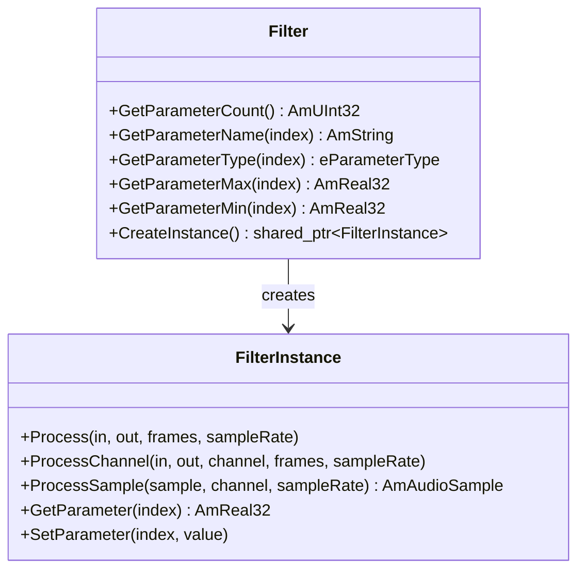

This tutorial walks you through creating a custom audio effect for the Amplitude engine. You will build a **Tremolo** effect — an amplitude modulation that periodically varies the volume of a sound — and learn how to register it as a plugin, define its asset file, and use it at runtime.

## Architecture Overview

In Amplitude, effects are built on top of the **Filter** system. To create a custom effect, you need two classes:

1. **Filter** — Defines the filter metadata (name, parameters, value ranges) and acts as a factory for creating instances.
2. **FilterInstance** — Holds per-sound state and performs the actual DSP processing.



At runtime, the engine creates a `FilterInstance` for each sound object that uses the effect. This ensures each sound has its own independent processing state.

## Step 1: Define the Filter Class

Create a header file for your custom filter. The `Filter` subclass defines the parameter metadata and the factory method:

```cpp
// TremoloFilter.h

#pragma once

#include <SparkyStudios/Audio/Amplitude/DSP/Filter.h>

namespace MyGame
{
    using namespace SparkyStudios::Audio::Amplitude;

    class TremoloFilter;

    // Forward declaration of the instance class
    class TremoloFilterInstance final : public FilterInstance
    {
    public:
        explicit TremoloFilterInstance(TremoloFilter* parent);
        ~TremoloFilterInstance() override = default;

    protected:
        AmAudioSample ProcessSample(
            AmAudioSample sample, AmUInt16 channel, AmUInt32 sampleRate) override;

    private:
        AmReal64 m_phase;
    };

    class TremoloFilter final : public Filter
    {
        friend class TremoloFilterInstance;

    public:
        // Parameter indices
        enum ATTRIBUTE
        {
            ATTRIBUTE_WET = 0,   // Dry/wet mix (0 = dry, 1 = fully wet)
            ATTRIBUTE_RATE,      // Modulation rate in Hz
            ATTRIBUTE_DEPTH,     // Modulation depth (0 = none, 1 = full)
            ATTRIBUTE_LAST
        };

        TremoloFilter();
        ~TremoloFilter() override = default;

        [[nodiscard]] AmUInt32 GetParameterCount() const override;
        [[nodiscard]] AmString GetParameterName(AmUInt32 index) const override;
        [[nodiscard]] eParameterType GetParameterType(AmUInt32 index) const override;
        [[nodiscard]] AmReal32 GetParameterMax(AmUInt32 index) const override;
        [[nodiscard]] AmReal32 GetParameterMin(AmUInt32 index) const override;

        std::shared_ptr<FilterInstance> CreateInstance() override;

    protected:
        AmReal32 m_rate;
        AmReal32 m_depth;
    };

} // namespace MyGame
```

Key points:

- The constructor must call `Filter("FilterName")` with a unique name. This name is used in effect asset files to reference your filter.
- Parameter index `0` **must** be `ATTRIBUTE_WET` — the dry/wet mix level. This is a mandatory convention expected by the engine for all filters.
- The `ATTRIBUTE_LAST` sentinel makes it easy to return the parameter count.

## Step 2: Implement the Filter

Now implement the filter metadata methods and the factory:

```cpp
// TremoloFilter.cpp

#include "TremoloFilter.h"

#include <cmath>

namespace MyGame
{
    // -------------------------------------------------------------------------
    // TremoloFilter (factory + metadata)
    // -------------------------------------------------------------------------

    TremoloFilter::TremoloFilter()
        : Filter("Tremolo") // This name must match the "effect" field in the JSON asset
        , m_rate(4.0f)
        , m_depth(0.5f)
    {}

    AmUInt32 TremoloFilter::GetParameterCount() const
    {
        return ATTRIBUTE_LAST;
    }

    AmString TremoloFilter::GetParameterName(AmUInt32 index) const
    {
        if (index >= ATTRIBUTE_LAST)
            return "Unknown";

        static const AmString names[ATTRIBUTE_LAST] = { "Wet", "Rate", "Depth" };
        return names[index];
    }

    eParameterType TremoloFilter::GetParameterType(AmUInt32 index) const
    {
        return eParameterType_Float;
    }

    AmReal32 TremoloFilter::GetParameterMax(AmUInt32 index) const
    {
        if (index >= ATTRIBUTE_LAST)
            return 0.0f;

        static const AmReal32 values[ATTRIBUTE_LAST] = {
            1.0f,  // Wet: 0-1
            20.0f, // Rate: 0-20 Hz
            1.0f   // Depth: 0-1
        };
        return values[index];
    }

    AmReal32 TremoloFilter::GetParameterMin(AmUInt32 index) const
    {
        if (index >= ATTRIBUTE_LAST)
            return 0.0f;

        static const AmReal32 values[ATTRIBUTE_LAST] = {
            0.0f, // Wet
            0.1f, // Rate (minimum 0.1 Hz)
            0.0f  // Depth
        };
        return values[index];
    }

    std::shared_ptr<FilterInstance> TremoloFilter::CreateInstance()
    {
        return ampoolshared(eMemoryPoolKind_Filtering, TremoloFilterInstance, this);
    }

    // -------------------------------------------------------------------------
    // TremoloFilterInstance (per-sound processing)
    // -------------------------------------------------------------------------

    TremoloFilterInstance::TremoloFilterInstance(TremoloFilter* parent)
        : FilterInstance(parent)
        , m_phase(0.0)
    {
        // Initialize the parameter buffer with the parent's default values
        Initialize(parent->GetParameterCount());

        m_parameters[TremoloFilter::ATTRIBUTE_RATE] = parent->m_rate;
        m_parameters[TremoloFilter::ATTRIBUTE_DEPTH] = parent->m_depth;
    }

    AmAudioSample TremoloFilterInstance::ProcessSample(
        AmAudioSample sample, AmUInt16 channel, AmUInt32 sampleRate)
    {
        const AmReal32 wet = m_parameters[TremoloFilter::ATTRIBUTE_WET];
        const AmReal32 rate = m_parameters[TremoloFilter::ATTRIBUTE_RATE];
        const AmReal32 depth = m_parameters[TremoloFilter::ATTRIBUTE_DEPTH];

        // Compute the modulation: a sine wave oscillating between (1-depth) and 1
        const auto modulation =
            static_cast<AmReal32>(1.0 - depth * 0.5 * (1.0 - std::sin(2.0 * AM_PI * m_phase)));

        // Advance the phase (only on channel 0 to keep channels in sync)
        if (channel == 0)
        {
            m_phase += 1.0 / static_cast<AmReal64>(sampleRate);
            if (m_phase >= 1.0 / static_cast<AmReal64>(rate))
                m_phase -= 1.0 / static_cast<AmReal64>(rate);
        }

        // Mix dry and wet signals
        const AmReal32 dry = static_cast<AmReal32>(sample);
        const AmReal32 wetSample = dry * modulation;

        return static_cast<AmAudioSample>(dry * (1.0f - wet) + wetSample * wet);
    }

} // namespace MyGame
```

### Processing Levels

The `FilterInstance` class offers three levels of processing granularity. Override the one that best fits your effect:

| Method | When to Use |
|--------|-------------|
| `ProcessSample()` | Simple per-sample effects (our tremolo example) |
| `ProcessChannel()` | Effects that need to see the entire channel buffer at once |
| `Process()` | Effects that need access to all channels simultaneously |

The default `Process()` implementation calls `ProcessChannel()` for each channel, and the default `ProcessChannel()` calls `ProcessSample()` for each sample. Override only the level you need.

!!! tip
    For performance-critical effects, override `Process()` or `ProcessChannel()` directly to process audio in bulk rather than sample-by-sample. This allows you to use SIMD optimizations or batch operations.

## Step 3: Register the Filter

Register your filter before the engine initializes. Use `Engine::RegisterExtension<T>()` which creates the instance and adds it to the internal registry:

```cpp
#include <SparkyStudios/Audio/Amplitude/Amplitude.h>

#include "TremoloFilter.h"

using namespace SparkyStudios::Audio::Amplitude;

// Store the shared pointer so we can unregister later
static std::shared_ptr<MyGame::TremoloFilter> sTremoloPlugin;

int main(int argc, char* argv[])
{
    ConsoleLogger logger(true);
    Logger::SetLogger(&logger);
    MemoryManager::Initialize();

    // ... file system setup ...

    // Register built-in extensions
    Engine::RegisterDefaultExtensions();

    // Register your custom filter
    sTremoloPlugin = Engine::RegisterExtension<MyGame::TremoloFilter>();

    // Initialize the engine
    amEngine->Initialize(AM_OS_STRING("pc.config.amconfig"));

    // ... load sound banks, run game loop, etc. ...

    // Cleanup
    amEngine->Deinitialize();

    // Unregister your custom filter
    Engine::UnregisterExtension(sTremoloPlugin);

    Engine::UnregisterDefaultExtensions();
    Engine::DestroyInstance();
    MemoryManager::Deinitialize();

    return 0;
}
```

!!! warning
    Filters must be registered **before** calling `amEngine->Initialize()` and unregistered **after** calling `amEngine->Deinitialize()`. The engine locks the filter registry during initialization to prevent modifications while running.

## Step 4: Create the Effect Asset

Create a JSON file in your project's `effects/` directory. The `effect` field must match the name you passed to the `Filter` constructor (`"Tremolo"`):

```json
{
  "id": 10,
  "name": "tremolo",
  "effect": "Tremolo",
  "parameters": [
    { "kind": "Static", "value": 1.0 },
    { "kind": "Static", "value": 4.0 },
    { "kind": "Static", "value": 0.5 }
  ]
}
```

The `parameters` array maps to your `ATTRIBUTE` enum in order:

| Index | Parameter | Value | Description |
|-------|-----------|-------|-------------|
| 0 | Wet | 1.0 | Fully wet (100% effect) |
| 1 | Rate | 4.0 | 4 Hz modulation speed |
| 2 | Depth | 0.5 | 50% modulation depth |

After creating the JSON file, [compile your project](../integration/compiling-amplitude-project.md) to generate the binary `.amfx` asset.

### Using RTPC for Dynamic Parameters

Parameters can be driven by [RTPC](../project/rtpc.md) values instead of static values. For example, to tie the tremolo depth to a game parameter:

```json
{
  "id": 10,
  "name": "tremolo",
  "effect": "Tremolo",
  "parameters": [
    { "kind": "Static", "value": 1.0 },
    { "kind": "Static", "value": 4.0 },
    {
      "kind": "RTPC",
      "rtpc": {
        "id": 1,
        "curve": {
          "parts": [
            {
              "start": { "x": 0.0, "y": 0.0 },
              "end": { "x": 1.0, "y": 1.0 },
              "fader": "Linear"
            }
          ]
        }
      }
    }
  ]
}
```

This maps the RTPC value (0 to 1) directly to the tremolo depth (0 to 1) using a linear curve. As your game updates the RTPC value at runtime, the tremolo depth changes automatically.

## Step 5: Assign the Effect to a Sound Object

Reference your effect in a [sound object](../project/sound-object.md) asset by its ID or name. The effect will be applied to the sound during playback through the audio pipeline.

## Memory Management

When allocating memory inside your filter, use Amplitude's memory pool system:

```cpp
// Allocate a buffer using the Filtering memory pool
auto* buffer = static_cast<AmReal32*>(
    ampoolmalloc(eMemoryPoolKind_Filtering, size * sizeof(AmReal32)));

// Create shared pointers using the pool allocator
auto instance = ampoolshared(eMemoryPoolKind_Filtering, TremoloFilterInstance, this);

// Free pool-allocated memory
ampoolfree(eMemoryPoolKind_Filtering, buffer);
```

Using the `eMemoryPoolKind_Filtering` pool ensures your allocations are tracked and reported alongside the engine's internal filter allocations.

## Summary

Creating a custom effect in Amplitude follows this pattern:

1. **Subclass `Filter`** — Define parameter metadata and implement `CreateInstance()`
2. **Subclass `FilterInstance`** — Implement the DSP logic in `ProcessSample()`, `ProcessChannel()`, or `Process()`
3. **Register** — Call `Engine::RegisterExtension<T>()` before engine initialization
4. **Define the asset** — Create a JSON file in `effects/` with the filter name and parameter values
5. **Build** — [Compile your project](../integration/compiling-amplitude-project.md) to generate the `.amfx` binary asset

The same pattern applies to all Amplitude plugins. For other plugin types, see:

- [Custom Codec](custom-codec.md) — Add support for new audio file formats
- [Custom Driver](custom-driver.md) — Implement a custom audio device backend
- [Custom Fader](custom-fader.md) — Create custom fade curve algorithms
