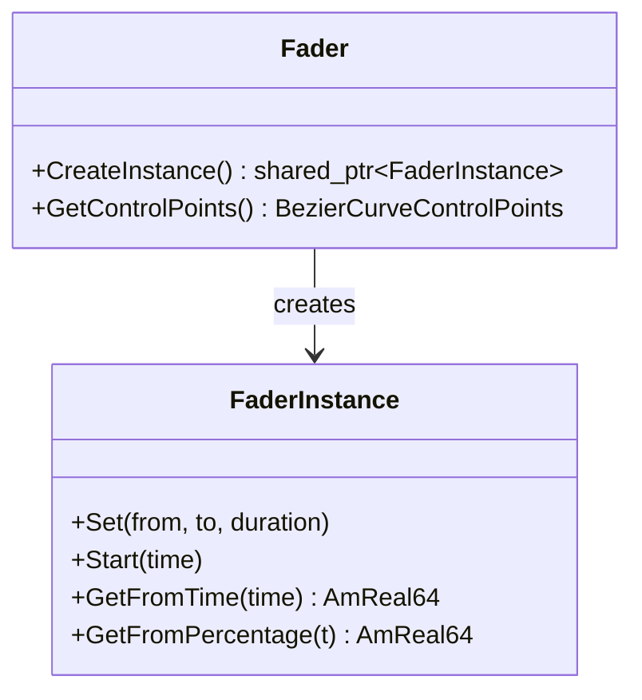

This tutorial walks you through creating a custom fader for the Amplitude engine. You will build a **Bounce Fader** — a fade curve that overshoots the target and settles back, like a bouncing ball — and learn how to register it so sound objects and buses can use it for smooth transitions.

## Architecture Overview

In Amplitude, a **Fader** defines a transition curve used to move a value (such as volume or gain) from one point to another over time. To create a custom fader, you need two classes:

1. **Fader** — Defines the fader name and the control points of its transition curve.
2. **FaderInstance** — Holds the runtime state and evaluates the curve at a given time.



Amplitude uses a fast one-dimensional cubic Bézier curve evaluator for all faders. The curve's first and last control points are fixed at `(0, 0)` and `(1, 1)`. You only need to define the two middle control points to shape the curve.

## Step 1: Define the Fader Classes

Create a header file for your custom fader:

```cpp
// BounceFader.h

#pragma once

#include <SparkyStudios/Audio/Amplitude/Amplitude.h>

using namespace SparkyStudios::Audio::Amplitude;

// Control points for a bounce curve:
// The curve shoots past the target (y > 1) at around 40% progress,
// then settles back to 1.0 at 100%.
constexpr BezierCurveControlPoints gBounceFaderCurveControlPoints = {
    0.30f, 1.20f,  // First control point: overshoots to 120% at 30% time
    0.65f, 0.90f   // Second control point: dips to 90% at 65% time
};

class BounceFaderInstance final : public FaderInstance
{
public:
    BounceFaderInstance()
    {
        // Initialize the transition curve with our custom control points
        m_curve = Transition(gBounceFaderCurveControlPoints);
    }
};

class BounceFader final : public Fader
{
public:
    BounceFader()
        : Fader("Bounce")
    {}

    std::shared_ptr<FaderInstance> CreateInstance() override
    {
        return ampoolshared(eMemoryPoolKind_Engine, BounceFaderInstance);
    }

    [[nodiscard]] BezierCurveControlPoints GetControlPoints() const override
    {
        return gBounceFaderCurveControlPoints;
    }
};
```

## Step 2: Register the Fader

Before initializing the engine, register your fader:

```cpp
#include "BounceFader.h"

int main(int argc, char* argv[])
{
    // ... initialize memory manager, file system, etc.

    // Register the custom fader
    Fader::Register(std::make_shared<BounceFader>());

    // Now initialize the engine
    Engine::Init(config);
}
```

!!! tip "Registration order"
    Faders must be registered **before** `Engine::Init()` is called. Once the engine is initialized, the fader registry is locked.

## Step 3: Use the Fader in a Project Asset

Create a sound object or bus asset that references your custom fader:

```json
{
  "id": 10,
  "name": "explosion",
  "path": "sounds/explosion.wav",
  "fader": "Bounce",
  "gain": 1.0
}
```

Or assign it to a bus for ducking transitions:

```json
{
  "id": 1,
  "name": "master",
  "gain": 1.0,
  "child_buses": [
    {
      "id": 2,
      "name": "sfx",
      "gain": 1.0,
      "duck_buses": [
        {
          "target_bus": "voices",
          "target_gain": 0.3,
          "fade_in": {
            "duration": 200,
            "fader": "Bounce"
          },
          "fade_out": {
            "duration": 500,
            "fader": "Bounce"
          }
        }
      ]
    }
  ]
}
```

When the engine applies the fader, it will use your custom bounce curve instead of a linear or ease transition.

## Understanding Bézier Curves

Amplitude faders are powered by cubic Bézier curves with fixed endpoints:

```
(0, 0)  ← fixed start
   ╲
    ╲  P1 = (x1, y1)  ← your first control point
     ╲
      ╲
       ╲  P2 = (x2, y2)  ← your second control point
        ╲
         ● (1, 1)  ← fixed end
```

The `y` coordinate of each control point determines the output value at that point in time. Values greater than `1.0` cause overshoot; values less than `1.0` cause undershoot.

### Built-in Fader Curves

Amplitude ships with several built-in faders. You can use their control points as a reference:

| Fader | Control Points `(x1, y1, x2, y2)` | Description |
|-------|-----------------------------------|-------------|
| **Constant** | `(0, 0, 0, 0)` | No transition; instant change. |
| **Linear** | `(0, 0, 1, 1)` | Straight line from start to end. |
| **Ease** | `(0.25, 0.1, 0.25, 1.0)` | Smooth start and end (default CSS ease). |
| **EaseIn** | `(0.42, 0, 1.0, 1.0)` | Slow start, fast end. |
| **EaseOut** | `(0, 0, 0.58, 1.0)` | Fast start, slow end. |
| **EaseInOut** | `(0.42, 0, 0.58, 1.0)` | Slow start and end, fast middle. |
| **Exponential** | `(0.9, 0.05, 0.95, 0.95)` | Sharp exponential curve. |
| **SCurve** | `(0.4, 0.0, 0.6, 1.0)` | S-shaped sigmoid curve. |

## When to Use Custom Faders

Custom faders are useful when you want audio transitions to match your game's feel:

- **Overshoot faders**: Great for cartoon-style impacts or bouncy UI sounds.
- **Slow-attack faders**: Perfect for ambient music crossfades.
- **Stepped faders**: Simulate discrete volume steps for retro aesthetics.
- **Asymmetric faders**: Fast attack, slow release for reverb tails.

## Runtime Behavior

When a fader is triggered (e.g., a bus starts ducking, a sound stops, or an RTPC value changes), the engine:

1. Creates a `FaderInstance` from the registered `Fader` factory.
2. Calls `Set(from, to, duration)` to configure the transition.
3. Calls `Start(time)` to begin the fade.
4. Each frame, calls `GetFromTime(currentTime)` to get the interpolated value.

The fader instance is automatically destroyed when the transition completes or when the associated sound object is released.

## Next Steps

- Learn how to write [custom effects](custom-effect.md) to process audio with DSP.
- Explore the [Fader API Reference](../api/engine/Fader.md) for the full interface.
- Experiment with the [Bézier curve visualizer](https://cubic-bezier.com/) to design your own curves.
