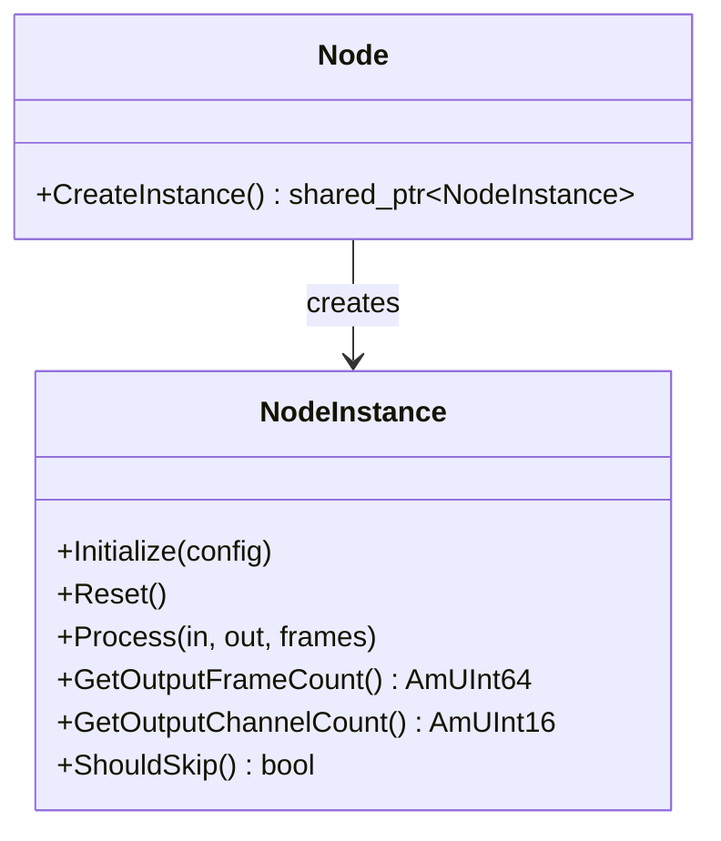

This tutorial walks you through creating a custom pipeline node for the Amplitude engine. You will build a **Gain LFO Node** — a node that modulates the gain of a sound with a low-frequency oscillator — and learn how to register it so it can be used in any pipeline asset.

## Architecture Overview

Pipeline nodes in Amplitude follow a two-class pattern:

1. **Node** — Defines the node metadata (name) and acts as a factory for creating instances.
2. **NodeInstance** — Holds per-layer state and performs the actual audio processing.



At runtime, the engine creates a `NodeInstance` for each active mixer layer that uses the pipeline containing your node.

## Step 1: Choose a Base Class

Amplitude provides several `NodeInstance` base classes depending on your node's role:

| Base Class | Role | Methods |
|------------|------|---------|
| `ProcessorNodeInstance` | In-place transformation | `Process()`, `Consume()`, `Connect()`, `Provide()` |
| `MixerNodeInstance` | Multi-input mixing | `Consume()` (multi), `Connect()`, `Provide()` |
| `ConsumerNodeInstance` | Output/sink | `Consume()`, `Connect()` |
| `ProviderNodeInstance` | Input/source | `Provide()` |

For a gain LFO, we need `ProcessorNodeInstance` because we transform audio in-place.

## Step 2: Define the Node Classes

Create a header file for your custom node:

```cpp
// GainLFONode.h

#pragma once

#include <SparkyStudios/Audio/Amplitude/Amplitude.h>

using namespace SparkyStudios::Audio::Amplitude;

class GainLFONodeInstance final : public ProcessorNodeInstance
{
public:
    GainLFONodeInstance();
    ~GainLFONodeInstance() override = default;

    void Initialize(AmObjectID id, const AmplimixLayer* layer, const PipelineInstance* pipeline, AmSize paramCount) override;
    void Reset() override;
    bool ShouldSkip() const override;

protected:
    const AudioBuffer* Process(const AudioBuffer* input) override;

private:
    AmReal32 _phase;
    AmReal32 _rate;
    AmReal32 _depth;
};

class GainLFONode final : public Node
{
public:
    GainLFONode()
        : Node("GainLFO")
    {}

    std::shared_ptr<NodeInstance> CreateInstance() const override
    {
        return ampoolshared(eMemoryPoolKind_Amplimix, GainLFONodeInstance);
    }
};
```

## Step 3: Implement the Instance

```cpp
// GainLFONode.cpp

#include "GainLFONode.h"

#include <cmath>

GainLFONodeInstance::GainLFONodeInstance()
    : _phase(0.0f)
    , _rate(5.0f)
    , _depth(0.1f)
{}

void GainLFONodeInstance::Initialize(AmObjectID id, const AmplimixLayer* layer, const PipelineInstance* pipeline, AmSize paramCount)
{
    // You can read custom configuration here if your node supports parameters
    NodeInstance::Initialize(id, layer, pipeline, paramCount);
}

void GainLFONodeInstance::Reset()
{
    _phase = 0.0f;
}

bool GainLFONodeInstance::ShouldSkip() const
{
    // Skip if depth is zero (no audible effect)
    return _depth <= 0.0f;
}

const AudioBuffer* GainLFONodeInstance::Process(const AudioBuffer* input)
{
    if (input == nullptr)
        return nullptr;

    const AmUInt16 channels = input->GetChannelCount();
    const AmUInt64 frames = input->GetFrameCount();
    const AmUInt32 sampleRate = amEngine->GetMixer()->GetSampleRate();

    // Copy input into the pre-allocated output buffer
    _output = *input;

    for (AmUInt64 i = 0; i < frames; ++i)
    {
        // Compute LFO value: sine wave [-1, 1]
        const AmReal32 lfo = std::sin(2.0f * AM_PI * _phase);

        // Map to gain range [1 - depth, 1 + depth]
        const AmReal32 gain = 1.0f + lfo * _depth;

        // Apply gain to all channels
        for (AmUInt16 ch = 0; ch < channels; ++ch)
        {
            _output[ch][i] *= gain;
        }

        // Advance phase
        _phase += _rate / static_cast<AmReal32>(sampleRate);
        if (_phase >= 1.0f)
            _phase -= 1.0f;
    }

    return &_output;
}
```

## Step 4: Register the Node

Before initializing the engine, register your node:

```cpp
#include "GainLFONode.h"

int main(int argc, char* argv[])
{
    // ... initialize memory manager, file system, etc.

    // Register the custom pipeline node
    Node::Register(std::make_shared<GainLFONode>());

    // Register built-in extensions
    Engine::RegisterDefaultExtensions();

    // Now initialize the engine
    amEngine->Initialize(AM_OS_STRING("pc.config.amconfig"));
}
```

!!! tip "Registration order"
    Nodes must be registered **before** `amEngine->Initialize()` is called. Once the engine is initialized, the node registry is locked.

## Step 5: Use the Node in a Pipeline

Create a pipeline asset JSON file that includes your custom node:

```json
{
  "id": 3,
  "name": "lfx_pipeline",
  "nodes": [
    { "id": 1, "name": "Input", "consume": [] },
    { "id": 2, "name": "Attenuation", "consume": [1] },
    { "id": 3, "name": "GainLFO", "consume": [2] },
    { "id": 4, "name": "StereoPanning", "consume": [3] },
    { "id": 5, "name": "Output", "consume": [4] }
  ]
}
```

Assign this pipeline to a sound object or the engine mixer configuration:

```json
{
  "id": 10,
  "name": "pulsing_ambience",
  "path": "sounds/ambience.wav",
  "loop": { "enabled": true },
  "pipeline": "lfx_pipeline"
}
```

## Key Concepts

### Process Signature

The `Process()` method for a `ProcessorNodeInstance` receives:

- `input`: The input audio buffer provided by the upstream node (may be `nullptr` if upstream is skipped)

It must return a pointer to the output `AudioBuffer`. For in-place processors, copy `*input` into the pre-allocated `_output` member, apply your transformation, and return `&_output`.

### Channel Count

Your node can change the channel count (e.g., mono-to-stereo panning) or preserve it (like our gain LFO). Override `GetOutputChannelCount()` on `NodeInstance` to return a different value; the default returns `m_inputChannelCount` (pass-through).

### ShouldSkip()

Implement `ShouldSkip()` to let the mixer bypass your node when it has no audible effect:

```cpp
bool ShouldSkip() const override
{
    return _depth <= 0.0f || _enabled == false;
}
```

This reduces CPU usage for layers where the node is inactive.

### Reset()

`Reset()` is called when a layer is recycled or reinitialized. Clear all state to ensure deterministic behavior:

```cpp
void Reset() override
{
    _phase = 0.0f;
}
```

## Parameters

To make your node configurable from the pipeline asset, read parameters during `Initialize()`:

```cpp
void GainLFONodeInstance::Initialize(AmObjectID id, const AmplimixLayer* layer, const PipelineInstance* pipeline, AmSize paramCount)
{
    // Access the pipeline asset definition
    auto* def = pipeline->GetDefinition();
    // Read custom parameters from the asset JSON
    // (requires extending the FlatBuffers schema)

    NodeInstance::Initialize(id, layer, pipeline, paramCount);
}
```

Full parameter support requires extending the pipeline FlatBuffers schema. For simple hard-coded behavior, compile-time constants are sufficient.

## Memory Management

Always use Amplitude's pool-aware allocation for node state:

```cpp
// Good: uses the Amplimix pool
return ampoolshared(eMemoryPoolKind_Amplimix, GainLFONodeInstance);

// Bad: bypasses memory tracking
return std::make_shared<GainLFONodeInstance>();
```

## Thread Safety

`Process()` is called from the audio thread. It must be:

- **Lock-free**: No mutexes, semaphores, or blocking operations.
- **Realtime-safe**: No memory allocation, file I/O, or logging.
- **Deterministic**: Same input must produce same output for a given state.

If you need to communicate with the game thread, use atomic variables or lock-free queues.

## Next Steps

- Review the [Pipeline Reference](../project/pipeline.md) for the full DAG architecture.
- Explore the [Node API Reference](../api/class_sparky_studios_1_1_audio_1_1_amplitude_1_1_node.md).
- Look at the built-in nodes in `sdk/src/Mixer/Nodes/` for production examples.
