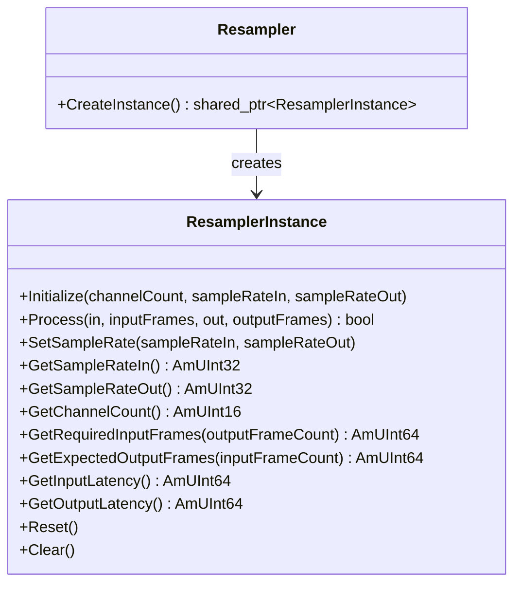

This tutorial walks you through creating a custom resampler for the Amplitude engine. You will build a **Linear Resampler** — a simple sample rate converter using linear interpolation — and learn how to register it so codecs and the mixer can use it for runtime sample rate conversion.

## Architecture Overview

In Amplitude, resampling is handled by the **Resampler** system. To create a custom resampler, you need two classes:

1. **Resampler** — Defines the resampler name and acts as a factory for creating instances.
2. **ResamplerInstance** — Holds the runtime state and performs the actual sample rate conversion.



At runtime, the engine creates a `ResamplerInstance` whenever a sound's sample rate does not match the output device rate, or when an encoder requests resampling.

## Step 1: Define the Resampler Classes

Create a header file for your custom resampler:

```cpp
// LinearResampler.h

#pragma once

#include <SparkyStudios/Audio/Amplitude/Amplitude.h>

using namespace SparkyStudios::Audio::Amplitude;

class LinearResamplerInstance final : public ResamplerInstance
{
public:
    LinearResamplerInstance();
    ~LinearResamplerInstance() override = default;

    void Initialize(AmUInt16 channelCount, AmUInt32 sampleRateIn, AmUInt32 sampleRateOut) override;
    bool Process(const AudioBuffer& input, AmUInt64& inputFrames, AudioBuffer& output, AmUInt64& outputFrames) override;
    void SetSampleRate(AmUInt32 sampleRateIn, AmUInt32 sampleRateOut) override;

    [[nodiscard]] AmUInt32 GetSampleRateIn() const override { return _sampleRateIn; }
    [[nodiscard]] AmUInt32 GetSampleRateOut() const override { return _sampleRateOut; }
    [[nodiscard]] AmUInt16 GetChannelCount() const override { return _channelCount; }
    [[nodiscard]] AmUInt64 GetRequiredInputFrames(AmUInt64 outputFrameCount) const override;
    [[nodiscard]] AmUInt64 GetExpectedOutputFrames(AmUInt64 inputFrameCount) const override;
    [[nodiscard]] AmUInt64 GetInputLatency() const override { return 0; }
    [[nodiscard]] AmUInt64 GetOutputLatency() const override { return 0; }

    void Reset() override {}
    void Clear() override {}

private:
    AmUInt16 _channelCount;
    AmUInt32 _sampleRateIn;
    AmUInt32 _sampleRateOut;
};

class LinearResampler final : public Resampler
{
public:
    LinearResampler()
        : Resampler("Linear")
    {}

    std::shared_ptr<ResamplerInstance> CreateInstance() override
    {
        return ampoolshared(eMemoryPoolKind_Engine, LinearResamplerInstance);
    }
};
```

## Step 2: Implement the Resampler

```cpp
// LinearResampler.cpp

#include "LinearResampler.h"

LinearResamplerInstance::LinearResamplerInstance()
    : _channelCount(0)
    , _sampleRateIn(48000)
    , _sampleRateOut(48000)
{}

void LinearResamplerInstance::Initialize(AmUInt16 channelCount, AmUInt32 sampleRateIn, AmUInt32 sampleRateOut)
{
    _channelCount = channelCount;
    _sampleRateIn = sampleRateIn;
    _sampleRateOut = sampleRateOut;
}

void LinearResamplerInstance::SetSampleRate(AmUInt32 sampleRateIn, AmUInt32 sampleRateOut)
{
    _sampleRateIn = sampleRateIn;
    _sampleRateOut = sampleRateOut;
}

AmUInt64 LinearResamplerInstance::GetRequiredInputFrames(AmUInt64 outputFrameCount) const
{
    const AmReal64 ratio = static_cast<AmReal64>(_sampleRateIn) / _sampleRateOut;
    return static_cast<AmUInt64>(std::ceil(outputFrameCount * ratio));
}

AmUInt64 LinearResamplerInstance::GetExpectedOutputFrames(AmUInt64 inputFrameCount) const
{
    const AmReal64 ratio = static_cast<AmReal64>(_sampleRateOut) / _sampleRateIn;
    return static_cast<AmUInt64>(inputFrameCount * ratio);
}

bool LinearResamplerInstance::Process(
    const AudioBuffer& input, AmUInt64& inputFrames,
    AudioBuffer& output, AmUInt64& outputFrames)
{
    if (_sampleRateIn == _sampleRateOut)
    {
        // No conversion needed; copy directly
        for (AmUInt16 ch = 0; ch < _channelCount; ++ch)
        {
            const AmAudioSample* src = input[ch].begin();
            AmAudioSample* dst = output[ch].begin();
            std::copy(src, src + inputFrames, dst);
        }
        outputFrames = inputFrames;
        return true;
    }

    const AmReal64 ratio = static_cast<AmReal64>(_sampleRateIn) / _sampleRateOut;
    const AmUInt64 outFrames = GetExpectedOutputFrames(inputFrames);

    for (AmUInt16 ch = 0; ch < _channelCount; ++ch)
    {
        const AmAudioSample* src = input[ch].begin();
        AmAudioSample* dst = output[ch].begin();

        AmReal64 readPos = 0.0;
        for (AmUInt64 i = 0; i < outFrames; ++i)
        {
            const AmUInt64 idx = static_cast<AmUInt64>(readPos);
            const AmReal64 frac = readPos - static_cast<AmReal64>(idx);

            const AmAudioSample s0 = src[AM_MIN(idx, inputFrames - 1)];
            const AmAudioSample s1 = src[AM_MIN(idx + 1, inputFrames - 1)];

            dst[i] = static_cast<AmAudioSample>(s0 + frac * (s1 - s0));
            readPos += ratio;
        }
    }

    outputFrames = outFrames;
    return true;
}
```

## Step 3: Register the Resampler

Before initializing the engine, register your resampler:

```cpp
#include "LinearResampler.h"

int main(int argc, char* argv[])
{
    // ... initialize memory manager, file system, etc.

    // Register the custom resampler
    Resampler::Register(std::make_shared<LinearResampler>());

    // Register other extensions and initialize the engine
    Engine::RegisterDefaultExtensions();
    amEngine->Initialize(AM_OS_STRING("pc.config.amconfig"));
}
```

!!! tip "Registration order"
    Resamplers must be registered **before** `amEngine->Initialize()` is called. Once the engine is initialized, the resampler registry is locked.

## How Resampling is Triggered

Amplitude automatically uses a resampler when:

1. A sound file's sample rate differs from the output device rate.
2. The `AudioConverter` DSP node needs to convert between formats.
3. The `amac` tool requests resampling during encoding.

The engine selects the resampler by name. The built-in `Default` resampler is used unless overridden.

## Latency

Resamplers introduce latency due to buffering and filter delay. Report your latency accurately:

```cpp
[[nodiscard]] AmUInt64 GetInputLatency() const override { return _filterTaps / 2; }
[[nodiscard]] AmUInt64 GetOutputLatency() const override { return 0; }
```

The engine uses these values to synchronize audio streams correctly.

## Quality vs. Performance

| Algorithm | Quality | CPU Cost | Best For |
|-----------|---------|----------|----------|
| **Linear** | Low | Very low | Quick preview, tests |
| **Nearest** | Very low | Minimal | Retro/8-bit aesthetics |
| **Sinc** | High | High | Production music |
| **Polyphase** | Very high | Medium-High | Real-time pitch shifting |

The built-in `Default` resampler in Amplitude uses a high-quality algorithm suitable for most games.

## Next Steps

- Review the [Resampler API Reference](../api/class_sparky_studios_1_1_audio_1_1_amplitude_1_1_resampler.md).
- Explore the built-in resampler implementation in the SDK source.
- Learn how to write [custom codecs](../tutorials/custom-codec.md) that use your resampler.
